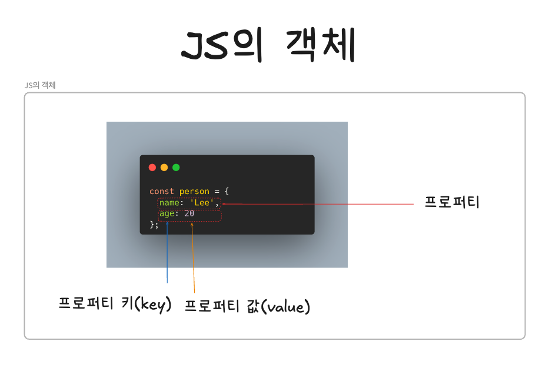
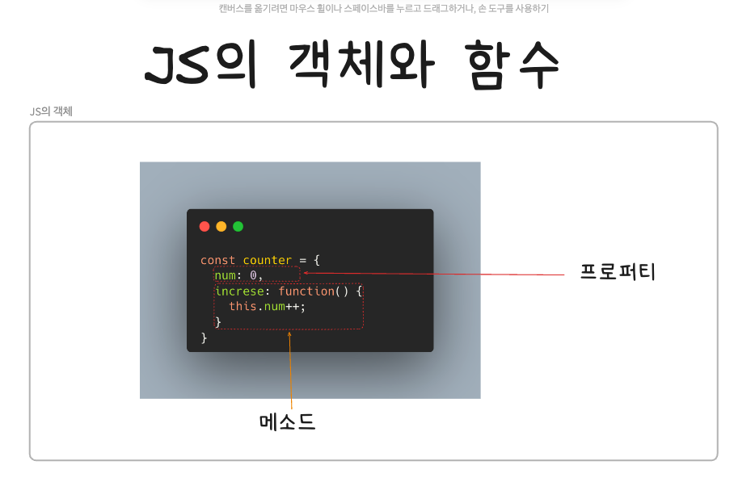

## 객체 리터럴

---


<br/>

### 1. 객체란?

객체 = 0개 이상의 프로퍼티로 구성된 집합이며, 프로퍼티는 키(key)와 값(value)로 구분됨

- 원시 타입 = 불변성을 가짐(immutable value)
- 객체 = 참조 타입 = 가변성을 가짐 (mutable value)

JS에서 사용할 수 있는 모든 값은 프로퍼티 값이 될 수 있음
- JS의 함수는 일급 객체임으로 값으로 처리할 수 있음
- 함수도 프로퍼티 값으로 사용할 수 있음

JS의 객체 예시

<br/>

프로퍼티 값이 함수일 경우 = 일반 함수와 구분하기 위해 메서드로 부름

객체의 프로퍼티와 메소드 예시
- 프로퍼티 = 객체의ㅏ 상태를 나타내는 값(data)
- 메소드 = 프로퍼티(data)를 참조하고 조작할 수 있는 동작



<br>
JS 내 함수는 객체로 처리됨
- 객체 내부의 메소드 또한 함수임으로 JS에서는 객체로 처리됨

<br/>

### 2. 객체 리터럴에 의한 객체 생성

객체 지향 언어 = 클래스를 정의하고, 필요한 시점에 new 연산자를 통해 인스턴스를 생성함
- 클래스 기반 객체지향언어

JS = 프로토타입 기반 객체 지향언어
- 객체 생성 방법
1. 객체 리터럴
2. Object 생성자 함수
3. 생성자 함수
4. Object.create 메소드
5. 클래스(ES6)

--> 객체 리터럴 외 JS에서 객체를 생성하는 방법은 모두 함수를 이용함

객체 리터럴 예시
- 중괄호({}) 사용
- 변수에 할당되는 시점에 JS엔진이 객체 리터럴을 해석해 객체 생성
- 객체 리터럴은 값으로 평가되며 이를 위해 맨 마지막에 세미콜론(;)을 붙여야 함
- 객체 리터럴에 프로퍼티를 포함시켜 객체를 생성함과 동시에 프로퍼티를 만들수도 있고, 객체 생성한 이후에 프로퍼티를 동적으로 추가할 수 있음

<br/>

```javascript
const person = {
    name: 'Lee',
    sayHello: function(){
        console.log(`Hello! My name is ${this.name}`);
    }
};

console.log(typeof person); //object
console.log(person); //{name: "Lee", sayHello: f}
```
<br/>

```javascript
const empty = {}; //빈 객체
console.log(typeof empty); //object
```
<br/>

### 3. 프로퍼티

객체 = 프로퍼티의 집합
프로퍼티 = 키와 값으로 구분됨
- 프로퍼티는 쉼표(,)로 구분됨
- 프로퍼티 키 = 빈 문자열을 포함하는 모든 문자열 또는 심벌 값
- 프로퍼티 값 = JS에서 사용할 수 있는 모든 값

```javascript
const person = {
    name: 'Lee', //키 = name, 값 = 'Lee'
    age: 20 //키 = age, 값 = 20
};
```

프로퍼티 키는 반드시 식별자 네이밍 규칙을 따라야 하는 것은 아니지만, 따르지 않을 경우 작은 따옴표('') 혹은 큰 따옴표("")로 감싸야 함

--> 프로퍼티 키는 원래 따옴표로 감싸야 하지만, 식별자 네이밍 규칙을 따를 경우 생략이 가능함

식별자 네이밍 규칙을 준수하는 프로퍼티 키와 준수하지 않는 프로퍼티 키
```javascript
const person = {
    firstName: 'Ung-mo', //식별자 네이밍 규칙 준수
    `last-name`: 'Lee' //식별자 네이밍 준수 X
};

console.log(person); //{firstName: "Ung-mo",last-name:"Lee"}
```
<br/>

따옴표를 생략한 프로퍼티 키
```javascript
const person = {
    firstName: 'Ung-mo',
    last-name: 'Lee' //SyntaxError: unexpected token
};
```
<br/>

문자열 또는 문자열 평가할 표현식으로 프로퍼티 키를 표현 가능함
- 빈 객체를 생성 후, 동적으로 프로퍼티 키와 값을 대입할 수 있음
```javascript
const obj = {};
const key = 'hello';

//ES5: 프로퍼티 키를 동적으로 생성
obj[key]  = 'world';

console.log(obj); //{hello: "world}
```
<br/>

빈 문자열을 프로퍼티 키로 설정한 예
- 키로서의 의미를 갖지 못하기 때문에 권장하지 않음
```javascript
const foo = {
    '': '' //빈 문자열로 프로퍼티 키를 사용 가능함
};

console.log(foo); //{"":""}
```
<br/>

암묵적 타입 변환에 의한 프로퍼티 키
- 프로퍼티 키에 문자열 혹은 심벌 값 외의 값을 사용하면 암묵적 타입변환을 통해 문자열이 됨

```javascript
const foo = {
    0: 1,
    1: 2,
    2: 3
};

console.log(foo); //{0: 1, 1: 2, 2: 3}
```
<br/>

예약어를 통한 프로퍼티 키 설정
- 예상치 못한 에러가 발생할 수 있으므로 권장하지 않음
```javascript
const foo = {
    var: '',
    function: ''
};

console.log(foo); //{var:"",function:""}
```
<br/>

중복된 프로퍼티 키를 사용한 예시
- 나중에 선언한 프로퍼티 키 - 값으로 먼저 선언한 프로퍼티를 덮어씀

```javascript
const foo = {
    name: 'Lee',
    name: 'Kim'
};

console.log(foo); //{name: "Kim"}
```
<br/>

### 4. 메서드

JS내 함수는 일급객체로 표현됨으로 프로퍼티 값으로 사용할 수 있음
- 메소드 =  프로퍼티 값이 함수일 경우 

```javascript
const circle = {
    radius: 5, //프로퍼티

    //원의 지름
    getDiameter: function(){
        return 2* this.radius; //this는 circle을 가리킴
    }
};

console.log(circle.getDiameter()); //10
```
<br/>

### 5. 프로퍼티 접근

객체의 프로퍼티에 접근하는 방법은 2가지로 구분됨
- 프로퍼티 키가 네이밍 규칙을 준수하는 이름이면 두 방식 보두 사용가능함
1. 마침표 표기법 = 마침표 프로퍼티 접근 연산자(.)를 사용함
2. 대괄호 표기법 = 대괄효 프로퍼티 접근 연산자([])를 사용함

```javascript
const person = {
    name: 'Lee'
};

//마침표 표기법
console.log(person.name); 

//대괄호 표기법
console.log(person['name']);
```
<br/>

대괄호 표기법
- 프로퍼티의 키를 따옴표로 감싼 문자열로 표기해야 함

-> 그렇지 않을 경우, JS엔진은 식별자로 해석함

```javascript
const person = {
    name: 'Lee'
};

console.log(person[name]); //ReferenceError: name is not defined
```
<br/>

객체 내 프로퍼티 키를 찾지 못한 경우 
- 객체 내 프로퍼티 키를 찾지 못한 경우 undefined를 반환
```javascript
const person = {
    name: 'Lee'
};

console.log(person.age); //undefined
```
<br/>

정리
객체 내 프로퍼티 키를 찾지 못한 경우
- 점 표기법 또는 대괄호 표기법으로 접근했을 때
    - 객체에 해당 프로퍼티가 존재하지 않으면 `undefiend`반환

```javascript
const obj = {key: 'value`};
console.log(obj.nonExistentKey); // undefined
```
<br/>

대괄호 표기법에서 식별자를 사용했으나 정의되지 않은 경우
- 대괄호 안에 따옴표 없이 식별자를 사용하려고 하면, JS엔진은 이를 변수(식별자)로 간주함
    - 만약 해당 변수(식별자)가 정의되어 있지 않으면 `ReferenceError`가 발생함
```javascript
const obj = { key: 'value' };
console.log(obj[nonExistentVariable]); // ReferenceError: nonExistentVariable is not defined
```
<br/>

### 6. 프로퍼티 값 갱신

이미 존재하는 프로퍼티에 값을 할당하면 프로퍼티의 값은 갱신됨
```javascript
const person = {
    name: 'Lee'
};

//프로퍼티 값 갱신
person.name = 'Kim';

console.log(person); //{name:"Kim"}
```
<br/>

### 7. 프로퍼티 동적 생성

객체 내 존재하지 않는 프로퍼티 값을 할당하면 프로퍼티 키 - 값이 동적으로 추가됨

```javascript
const person = {
    name: 'Lee'
};

//프로퍼티 동적 생성
person.age = 20;

console.log(person); //{name: "Lee", age:20}
```
<br/>

### 8. 프로퍼티 삭제

delete연산자를 통해 객체의 프로퍼티를 삭제할 수 있음

```javascript
const person = {
    name: 'Lee'
};

person.age = 20;

//프로퍼티 삭제
delete person.age;

//존재하지 않는 프로퍼티 삭제 시 무시됨
delete person.address;

console.log(person); //{name: "Lee"}
```
<br/>


### 9. ES6에서 추가된 객체 리터럴의 확장 기능

#### 1. 프로퍼티 축약 표현


```javascript
//ES5
const x = 1, y = 2;

const obj = {
    x: x,
    y: y
};

console.log(obj); //{x:1, y:2}
```
<br/>

프로퍼티 값으로 변수를 사용 시, 프로퍼티 키와 이름이 동일하다면 프로퍼티 키를 생략할 수 있음
```javascript
//ES6
let x = 1, y = 2;

//프로퍼티 축약 표현
const obj = {x,y};

console.log(obj); //{x:1, y:2}
```
<br/>

#### 2. 계산된 프로퍼티 이름

```javascript
//ES5
const prefix = 'prop';
const i = 0;

const obj = {};

//계산된 프로퍼티 명으로 프로퍼티 키를 동적 생성
obj[prefix + '-' + ++i] = i;
obj[prefix + '-' + ++i] = i;
obj[prefix + '-' + ++i] = i;

console.log(obj); //{prop-1: 1, prop-2: 2, prop-3:3}
```
<br/>

객체 리터럴 내부에서도 계산된 프로퍼티 이름으로 프로퍼티 키를 동적으로 생성할 수 있음

```javascript
//ES6
const prefix = 'prop';
let i = 0;

const obj = {
    `${prefix}-${++i}`:i,
    `${prefix}-${++i}`:i,
    `${prefix}-${++i}`:i,
};

console.log(obj); //{prop-1: 1, prop-2: 2, prop-3: 3}
```
<br/>

#### 3. 메서드 축약 표현


```javascript
const obj = {
    name: 'Lee',
    sayHi: function(){
        console.log('Hi! ' + this.name);
    }
};

obj.sayHi(); //Hi! Lee
```
<br/>

메서드 정의시 function 키워드를 생략한 축약 표현을 사용가능함

```javascript
const obj = {
    name: 'Lee',
    //메소드 축약 표현
    sayHi(){
        console.log('Hi!' + this.name);
    }
};

obj.sayHi(); //Hi! Lee
```
<br/>