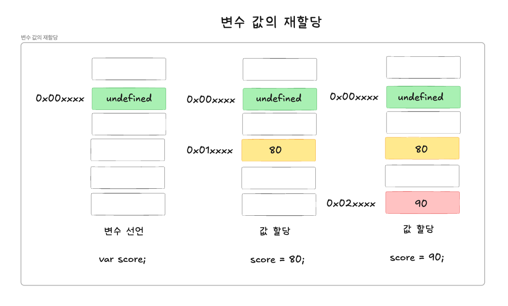
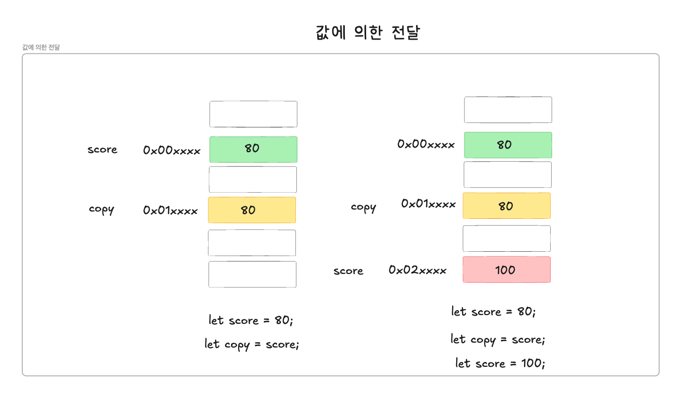
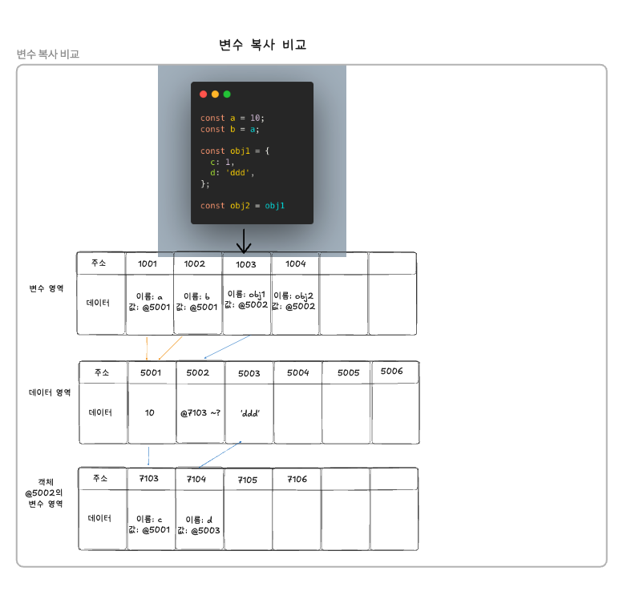

## 원시값과 객체의 비교

---

### 1. 원시 값

#### 1.변경 불가능한 값

원시 타입 = 불변 값
- 한번 할당된 메모리 상의 원시 타입의 값은 변경할 수 없음 = 불변성
- 값의 재할당으로 변수가 참조하던 메모리 공간의 주소가 변경됨
- 불변성을 갖는 원시 값을 할당한 변수는 재할당으로만 변수의 값을 변경할 수밖에 없음


<br/>

#### 2.문자열과 불변성

ECMAScript사양에선 문자열 타입은 2바이트, 숫자 타입은 8바이트로 규정하고 잇음
- 그 외의 원시타입은 크기를 명확하게 규정하고 있지 않음

```javascript
const str1 = ''; //빈 문자열
const str2 = 'Hello'; //5개의 문자로 이루어진 문자열
```
<br/>

문자열은 유사 배열 객체이며, 이터러블이므로 배열과 유사하게 각 문자에 접근이 가능함
<br/>

**유사 배열 객체**
- 배열처럼 인덱스로 프로퍼티 값에 접근할 수 있고 length 프로퍼티를 갖는 객체를 의미함
- 배열처럼 인덱스를 통해 각 문자에 접근할 수 있으며, for문을 통해 순회할 수 있음

```javascript
const str = 'string';

//문자열은 유사 배열임으로 배열과 유사하게 인덱스를 사용해 각 문자에 접근할 수 있음
console.log(str[0]); //s
console.log(str.length); //6
console.log(str.toUpperCase()); //String
```
<br/>

```javascript
const str = 'string'

//문자열은 유사 배열임으로 인덱스를 통해 각 문자에 접근할 수 있지만, 원시값임으로 값을 변경할 수 없음
//에러는 발생하지 않음
str[0] = 'S';

console.log(str); //string
```
<br/>

#### 3.값에 의한 전달

```javascript
let score = 80;
let copy = score;

console.log(score); //80
console.log(copy); //80
console.log(score, copy); //80 80
console.log(score === copy); //true

score = 100;
console.log(score); //100
console.log(copy); //80
console.log(score, copy); //100 80
console.log(score === copy); //false
```
<br/>



값의 전달
- 값을 전달하는 것이 아닌 해당 데이터 영역(값)의 주소를 전달함
<br/>

### 2. 객체

JS의 객체, JS엔진의 객체 생성 방식
- JS는 객체를 생성할 때 프로퍼티 키-값(해시테이블 처럼 키-값)을 이용하여 생성함
- JS엔진의 경우,  히든 클래스를 매커니즘을 통해 구현함

#### 1.변경 가능한 값

모든 객체(참조 타입)은 변경이 가능하며, 이를 가변성이라고 함
- 객체에 할당한 변수는 재할당 없이 프로퍼티 값을 변경할 수 있음
- 프로퍼티를 동적으로 값을 갱신할 수도 있으며, 프로퍼티 자체를 삭제할 수 있음


```javascript
const person = {
    name: 'Lee'
};

console.log(person); //{name: "Lee"}

//프로퍼티 값 갱신
person.name = 'Kim';

//프로퍼티 동적 생성
person.address = 'Seoul';

console.log(person); //{name: "Kim", address: "Seoul"}
```
<br/>

**정리**

| 상황 | 얕은 복사 | 깊은 복사 |
| --- | --- | --- |
| **원시 타입 프로퍼티만 있는 경우** | 항상 독립적 (얕은/깊은 구분 없음) | 항상 독립적 (얕은/깊은 구분 없음) |
| **참조 타입 프로퍼티가 있는 경우** | 참조값만 복사 → 내부 데이터 공유 | 내부 데이터까지 모두 독립적으로 새롭게 생성 |
| **중첩된 객체/배열 포함 여부** | 최상위 레벨만 독립적 | 모든 레벨에서 독립적 |


#### 참조에 의한 전달

```javascript
let person ={
    name: 'Lee'
};

//얕은 복사
let copy = person;

//copy와 person은 동일한 객체 참조
console.log(copy === person); //true

//copy를 통해 객체를 변경함
copy.name = 'Kim';

//person을 통해 객체 변경
person.address = 'Seoul';

//copy와 person은 동일한 객체
console.log(person); //{name: "Kim", address: "Seoul"}
console.log(copy); //{name: "Kim", address: "Seoul"}
```
<br/>


<br/>