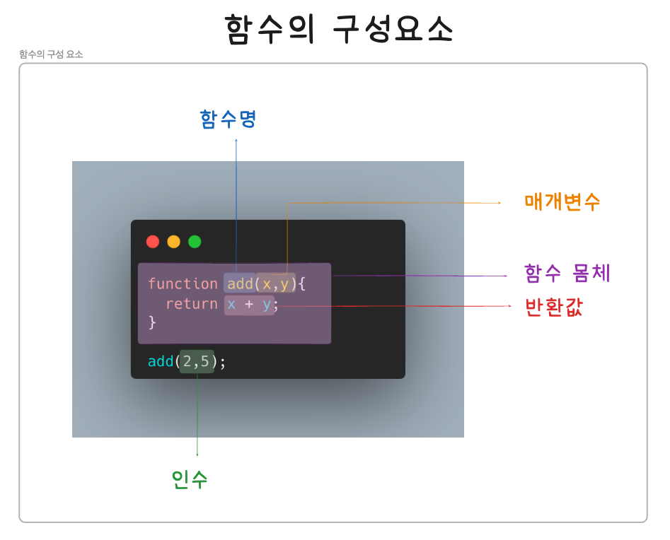
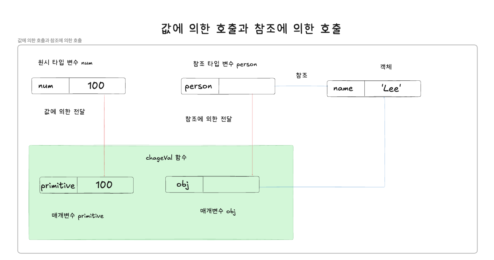

## 함수

---

### 1.함수란?

함수
- 일련이 과정을 문으로 구현하고 코드 블록으로 감싸서 하나의 실행 단위로 정의한 것
- 매개변수 = 함수 내부로 입력을 전달받는 변수
- 인수 = 입력
- 반환값 = 출력 값
```JavaScript
//f(x,y) = x + y
function add(x,y) {
    return x + y;
}

//f(2,5) = 7
add(2,5); //7
```
<br/>




함수 정의
```JavaScript
//함수 정의
function add(x,y){
    return x + y;
}
```
<br/>

함수 호출 = 함수 정의 후 인수를 매개변수를 통해 함수에 전달한 후 호출해야 함수가 실행됨
```JavaScript
//함수 호출
var result = add(2,5);

//함수 add에 인수 2,5를 전달하면서 호출하면 반환값 7을 반환함
console.log(result); //7
```
<br/>

### 2.함수를 사용하는 이유

함수를 통해 중복을 제거하고 코드를 재사용 가능함
- 유지보수의 편의성을 높이고 실수를 줄여 코드의 신뢰성을 높일 수 있음
- 함수 = 객체 타입의 값임
- 가독성을 높이기 위해 함수의 이름을 역할을 파악할 수 있도록 잘 지어야 함
<br/>

### 3.함수 리터럴

JS 함수 = 객체 타입의 값
- 함수또한 함수 리터럴로 생성될 수 있음

함수 리터럴
- function 키워드, 함수 이름, 매개변수 목록, 함수 몸체로 구성됨

```JavaScript
//변수에 함수 리터럴을 할당
var f = functin add(x,y) {
    return x + y;
};
```
<br/>

함수 리터럴의 구성 요소

| 구성요소 | 설명 |
|------|----|
|함수명|1.함수명은 식별자이기 때문에 네이밍 규칙을 준수해야 함<br/> 2.함수 이름은 함수 몸체 내에서만 참조할 수 있는 식별자임<br/> 3.함수 이름은 생력할 수 있으며, 기명 함수 = 이름이 잇는 함수, 무명/익명 함수 = 이름이 없는 함수라고 함|
|매개변수 목록|1.0개 이상의 매개변수를 소괄호로 감싸고 쉼표로 구분함<br/> 2.각 매개변수에는 함수를 호출할 때 지정된 인수가 순서대로 할당됨(매개변수 목록은 순서에 의미가 있음)<br/> 매개변수는 함수 몸체 내애서 변수와 동일하게 취급됨으로 식별자 네이밍 규칙을 준수해야 함|
|함수 몸체|1.함수가 호출되었을 때 일괄적으로 실행될 문들을 하나의 실행 단위로 정의한 코드 블록임<br/> 2.함수 모멫는 함수 호출에 의해 실행됨|
<br/>

함수 = 객체
- 일반 객체는 호출할 수 없지만 함수는 호출할 수 있음
- 함수는 고유한 프로퍼티를 가짐
<br/>

### 4. 함수 정의

함수는 정의된다고 표현함
- 함수 선언문이 평가되면 암묵적으로 생성되고 함수 객체가 할당됨

함수 선언문
```JavaScript
function add(x,y){
    retrun x + y;
}
```
<br/>

함수 표현식
```JavaScript
var add = function(x,y){
    return x + y;
};
```
<br/>

Function 생성자 함수
```JavaScript
var add = new Function('x','y', 'return x + y');
```
<br/>

화살표 함수(ES6)
```JavaScript
var add = (x,y) => x + y;
```
<br/>

#### 함수 선언문
```JavaScript
//함수 선언문
function add(x,y){
    return x + y;
}

//함수 참조
//console.dir은 console.log와 달리 함수 객체의 프로퍼티까지 출력함
//Node.js 환경에서는 console.log와 같은 결과가 출력됨
console.dir(add); //f add(x,y)

//함수 호출
console.log(add(2,5)); //7
```
<br/>

함수 리터럴은 함수명을 생략할 수 있으나, 함수 선언문은 이름을 생략할 수 없음
- 함수 선언문은 표현식이 아닌 문임
- 함수 선언문을 실행하면 undefined가 실행됨

```JavaScript
//함수 선언문은 함수 이름을 생략할 수 없음
function (x,y) { //SyntaxError
    return x + y;
}
```
<br/>


#### 함수 표현식

JS의 함수
- 객체 타입의 값
- 값처럼 변수에 할당할 수도 있으며 프로퍼티 값이 될 수도 있으며 배열의 요소가 될 수도 있음
- 위와 같은 성질을 갖는 객체를 일급 객체라고함

JS함수 = 일급 객체
- 함수 표현식 = 함수 리터럴로 생성한 함수 객체를 변수에 할당할 수 있음

```JavaScript
//함수 표현식
var add = function (x,y) {
    return x + y;
};

console.log(add(2,5)); //7
```
<br/>

함수 리터럴 = 함수 이름을 갱략할 수 있음 = 익명함수

```JavaScript
//기명 함수 표현식
var add = function foo(x,y){
    return x + y;  
};

//함수 객체를 가리키는 식별자로 호출
console.log(add(2,5)); //7

//함수 이름으로 호출하면 ReferenceError가 발생함
//함수 이름은 함수 몸체 내부에서만 유효함
console.log(foo(2,5)); //RerenceError
```

#### 함수 생성 시점과 함수 호이스팅

함수 선언문과 함수 표현식
- 함수 선언문으로 정의된 함수와 함수 표현식으로 정의된 함수의 생성 시점은 다름
- 함수 선언문 = 런타임 이전에 JS엔진에 의해 먼저 실행됨(호이스팅)
  - 변수의 호이스팅과 함수의 호이스팅은 서로 차이가 있음
  - 함수 선언문 전 함수 호출에 의해 호이스팅되어 undefiend가 출력됨
- 함수 표현식 = 변수에 할당되는 값
  - 변수가 할당되는 시점, 런타임에 평가됨
  - 함수 호이스팅에 의해 발생하는 것이 변수 호이스팅이 발생함
  - 변수에 값 할당 이전에 호출되면 TypeError가 발생함 
```JavaScript
//함수 참조
console.dir(add); //f add(x,y);
console.dir(sub); //undefined

//함수 호출
console.log(add(2,5)); //7
console.log(sub(2,5)); //TypeError: sub is not a function

//함수 선언문
function add(x,y){
    return x + y;
}

//함수 표현식
var sub = function (x,y){
    return x - y;
}
```
<br/>

#### Function 생성자 함수

빌트인 함수인 Function 생성자 함수에 매개변수 목록과 함수 몸체를 문자열로 전달하면서 new 연산자와 함께 호출하면 함수 객체를 생성해서 반환함

생성자 함수
- 객체를 생성하는 함수를 의미함

```JavaScript
var add = new Function('x', 'y', 'return x + y');

console.log(add(2,5)); //7
```

Function 생성자 함수로 생성한 함수는 클로저를 생성하지 않는 등, 함수 선언문이나 함수 표현식으로 생성한 함수와 다르게 동작함

```JavaScript
var add1 = (function() {
    var a = 10;
    return function(x,y){
        return x + y + a;
    };
}());

console.log(add1(1,2)); //13

var add2 = (function(){
    var a = 10;
    return new Function('x', 'y', 'return x + y + a;');
}());

console.log(add2(1,2)); //ReferenceError
```
<br/>

#### 화살표 함수

ES6에서 도입된 화살표 함수는 function 키워드 대신 화살표(=>)를 이용하여 간단하게 함수를 선언할 수 있음
- 화살표 함수는 항상 익명 함수로 정의함
- 화살표 함수는 생성자 함수로 사용할 수 없음
- 기존 함수와 this 바인딩 방식이 다르고 prototype프로퍼티가 없으며 argument 객체를 생성하지 않음

```JavaScript
//화살표 함수
conset add = (x,y) => x + y;
console.log(add(2,5)); //7
```
<br/>

### 5. 화살표 함수

#### 매개변수와 인수

함수를 실행하기 위해 필요한 값을 외부에서 함수 내부로 전달할 필요가 있는 경우, 매개변수를 통해 인수를 전달함
- 인수 = 값으로 평가될 수 있는 표현식이어야 함
  - 인수는 함수를 호출할 때 지정하며, 갯수와 타입에 제약이 없음

```JavaScript
//함수 선언문
function add(x,y){
    return x + y;
}

//함수 호출
//인수 1과 2가 매개변수 x와 y에 순서대로 할당되고 함수 몸체의 문들이 실행됨
var result = add(1,2);
```
<br/>

매개변수
- 함수를 정의할 때 선언하며, 함수 몸체 내부에서 변수와 동일하게 취급됨
- 함수 몸체 내부에서 암묵적으로 매개변수가 생성되고 일반 변수와 마찬가지로 undefined로 초기화된 이후 인수가 순서대로 할당됨
- 매개변수의 스코프는 함수 내부임

```JavaScript
function add(x,y){
    console.log(x,y); //2 5
    return x + y;
}

add(2, 5);

//add함수의 매개변수 x,y는 함수 몸체 내부에서만 참조할 수 있음
console.log(x,y); //ReferenceErro
```
<br/>

함수는 매개변수의 갯수와 인수의 갯수가 일치하는지 체크하지 않음
- 함수를 호출할 때 매개변수 만큼 인수를 전달하는 것이 일반적이지만, 그렇지 않은 경우에도 에러는 발생하지 않음
- 인수가 부족해서 할당되지 않은 매개변수의 값은 undefiend임

매개변수 x에는 인수 2가 전달되지만, 매개변수 y에는 전달할  인수가 없음
- 매개변수 y는 undefined로 초기화된 상태임
- 함수의 몸체 x + y 는 2 + undefined와 같으므로 NaN이 반환됨
```JavaScript
function add(x,y){
    return x + y;
}

console.log(add(2)); //NaN
```
<br/>

매개변수보다 인수가 더 많은 경우, 초과된 인수는 무시됨
```JavaScript
function add(x,y){
    return x+y;
}

console.log(add(2,5,10)); //7
```
<br/>

초과된 인수는 arguments 객체의 프로퍼티로 보관됨
```JavaScript
function add(x,y){
    console.log(arguments);
    //Arguments(3)[2,5,10]
    
    return x + y;
}

add(2, 5, 10);
```
<br/>

#### 인수 확인

```JavaScript
function add(x,y){
    return x + y;
}

console.log(add(2)); //NaN
console.log(add('a','b'));//'ab'
```
<br/>

위와 같은 코드는 에러가 발생하지 않음
- 오류가 발생하지 않는 이유
1. JS의 함수는 매개변수와 인수의 갯수가 일치하는지 확인하지 않음
2. JS는 동적 타입 언어임
   - JS 함수는 매개변수의 타입을 사전에 지정할 수 없음

따라서 JS의 경우 함수를 정의할 때 적절한 인수가 전달되었는지 확이할 필요가 있음

```JavaScript
function add(x,y){
  if(typeof x !== 'number' || typeof y !='number'){
    //매개변수를 통해 전달된 인수의 타입이 부적절한 경우 에러를 발생시킴
    throw new TypeError('인수는 모두 숫자 값이어야 합니다.');
  }
  return x + y;
}

console.log(add(2)); //TypeError: 인수는 모두 숫자 값이어야 함
console.log(add('a','b'); //TypeError: 인수는 모두 숫자 값이어야 함
```
<br/>

함수 내부에 적절한 인수가 전달되었는지 확인하더라도 부적절한 호출을 사전에 방지할 수 없고, 런타임 시에 에러가 발생함
- TS(타입 스크립트)와 같은 정적 타입을 선언할 수 있는 방법을 도입하여 컴파일 시점에 부적적한 호출을 방지하게 함

arguments 객체를 통해 인수 개수를 확인할 수 있음
```JavaScript
function add(a,b,c){
  a = a || 0;
  b = b || 0;
  c = c || 0;
  return a + b + c;
}

console.log(add(1,2,3)); //6
console.log(add(1,2)); //3
console.log(add(1)); //1
console.log(add()); //0
```
<br/>

ES6에 도입된 매개변수 기본값을 사용하면 함수 내에서 수행하던 인수 체크 및 초기화를 간소화할 수 있음
- 매개변수 기본값은 매개변수에 인수를 전달하지 않을 경우와 undefined를 전달할 경우에만 유효함

ES6의 매개변수 기본값 사용 
```JavaScript
function add(a = 0, b = 0, c = 0){
  return a + b + c;
}

console.log(add(1,2,3)); //6
console.log(add(1,2)); //3
console.log(add(1)); //1
console.log(add()); //0
```
<br/>

#### 매개변수의 최대 개수
ESCMAScript 사양에서는 매개변수의 최대 갯수에 대해 명시적으로 제한하고 있지 않음
- 물리적 한계가 있으므로 JS엔진마다 매개변수의 최대 갯수에 대한 제한이 있겠지만, 충분히 많은 매개변수에 지정할  수 있음

매개변수는 순서에 의미가 존재함
- 매개변수의 변수의 갯수나 순서가 변경되면 함수의 호출 방법도 변경됨
- 유지보수성이 나빠짐
- 함수의 매개변수는 적을 수록 좋음
- 이상적인 함수 = 한 가지 일만 해야 하며 가급적으로 작게 만들어야 함(최대 3개 이상 넘지 않는 것을 권장함)

jQuery의 Ajax메서드에 객체로 인수를 전달하는 예시
```JavaScript
$a.jax({
  method: 'POST',
  url: '/user',
  data: { id: 1, name: 'Lee'},
  cache: false
}); 
```
<br/>

객체를 인수로 사용하는 경우 = 프로퍼티 키만 정확히 지정하면 매개변수의 순서를 신경쓰지 않아도 됨
- 명시적으로 인수의 의미를 설명하는 프로퍼티 키를 사용하게 됨으로 코드의 가독성과 실수가 줄어듬
- 단, 함수 외부에서 함수 내부로 전달한 객체를 함수 내부에서 변경하면 함수 외부 객체가 변경되는 효과가 일어남으로 주의해야 함


#### 반환문

함수는 return 키워드와 표현식(반환값)으로 실행 결과를 함수 외부로 반환할 수 있음
- multiply함수 = 두 개의 인수를 전달받아 곱한 값을 반환함
- 함수 호출 = 표현식, 함수 호출 표현식 = return 키워드가 반환한 평가 결과(반환값)
```JavaScript
function multiply(x,y){
  return x * y; //반환문
}

//함수 호출은 반환값으로 평가됨
var result = multiply(3,5);
```
<br/>

반환값의 역할
1. 반환문은 함수의 실행을 중단하고 함수 몸체를 빠져 나감
- 반환문 이후에 다른 문이 존재하면 해당 문은 실행되지 않고 무시됨

```JavaScript
function multiply(x,y){
  retrun x * y; //반환문
  //반환문 이후 해당 문은 무시됨
  console.log('실행되지 않음');
}

console.log(multiply(3,5)); //15
```
<br/>

2. 반환문은 return 키워드 뒤에 오는 표현식을 평가하여 반환함
- return 키워드 뒤에 반환값으로 사용할 표현식을 명시적으로 지정하지 않으면 undefined가 반환됨

```JavaScript
function foo(){
  retrun;
}

console.log(foo()); //undefined
```
<br/>

반환문은 생략할 수 있음
- 함수 몸체의 마지막 문까지 실행한 후 암묵적으로 undefined를 반환함
```JavaScript
function foo(){
  //반환문 생략 시 암묵적으로 undefined가 반환됨
} 

console.log(foo()); //undefined
```
<br/>

return 키워드와 반환값으로 사용할 표현식 사이에 줄바꿈이 있으면 자동 삽입 기능에 의해 세미콜론이 추가됨
- return 키워드 후 줄 바꿈 시 자동으로 세미콜론(;)이 삽입됨으로 무시됨

```JavaScript
fucntion multiply(x,y){
  return
  //무시됨
  x * y;
}

console.log(multiply(3,5)); //undefined
```
<br/>

반환문은 함수 몸체 내부에서만 사용가능함
- 전역에서 반환문을 사용하면 문법에러(SyntaxError)가 발생함
```JavaScript
<!DOCTYPE html>
<html>
<body>
  <script>
    return; //SyntaxError
  </script>
</body>
</html> 
```
<br/>

Node.js는 모듈 시스템에 의해 파일별로 독립적인 파일 스코프를 가짐
- Node.js 환경에서는 파일의 가장 바깥 영역에 반환문을 사용해도 에러가 발생하지 않음

### 6.참조에 의한 전달과 외부 상태의 변경

원시 값 = 값에 의한 전달(pass by value)
객체 = 참조에 의한 전달(pass by reference)
- 매개변수도 함수 몸체 내부에서 변수와 동일하게 취급됨
- 따라서 매개변수도 값에 의한 전달, 참조에 의한 전달 방식을 그대로 따름

함수를 호출하면서 매개변수에 값을 전달하는 방식 = 값에 의한 호출(call by value), 참조에 의한 호출(call by reference)로 구별할 수 있음

```JavaScript
//매개변수 primitive는 원시 값을 전달받고, 매개변수 obj는 객체를 전달받음
function chageVal(primitive, obj){
  primitive += 100';
  obj.name = 'Kim';
}

//외부 상태
var num = 100;
var person = {name: 'Lee' };

console.log(num); //100
console.log(person); //{name: "Lee"}

//원시 값은 값 차제가 복사되어 전달됨, 객체는 참조 값이 복사되어 전달됨
changeVal(num, person);

//원시 값은 원본이 훼손되지 않음
console.log(num); //100

//객체의 원본은 훼손됨
console.log(person); //{name: "Kim"}
```
<br/>

changeVal함수 

매개변수 primitve의 경우
- 원시 값은 불변값임으로 값의 재할당으로 원시 값을 새로운 원시 값으로 교체함
- 이전의 원본 데이터는 훼손되지 않음
- 함수 외부에서 함수 몸체 내부로 전달한 원시 값의 원본을 변경하는 어떠한 효과도 발생하지 않음

매개변수 obj의 경우
- 참조 값은 가변값임으로 재할당 없이 직접 할당된 객체를 변경함
- 함수 외부에서 함수 몸체 내부로 전달한 참조 값에 의해 원본 객체가 변경되는 효과가 발생함


<br/>

person과 같은 객체를 함수 외부에서 변경하면 상태 변경을 추적하기 어려움
- 코드의 복잡성이 증가되고 가독성이 떨어짐
- 객체의 변경을 추적하려면 옵저버 패턴 등을 통해 객체를 참조를 공유하는 모든 이들에게 변경 사실을 통지하고 이에 대한 대응이 힢요함
- 또다른 방법으로 불변 객체로 만들어서 사용하는 방법이 존재함
  - 객체를 새로 생성하는 비용은 새로 들지만, 객체를 원시 값처럼 불가능한 값으로 동작하게 함
  - 깊은 복사를 통해서 객체를 생성하고 재할당을 통해 교체해야 함

순수 함수 = 외부 상태를 변경하지 않고, 외부 상태에 의존하지 않는 함수
함수형 프로그램 = 순수 함수를 통해 부수 효과를 억제하여 프로그램의 안정성을 높이려는 패러다임

<br/>
