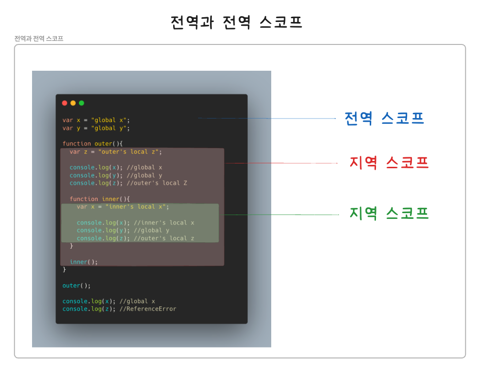
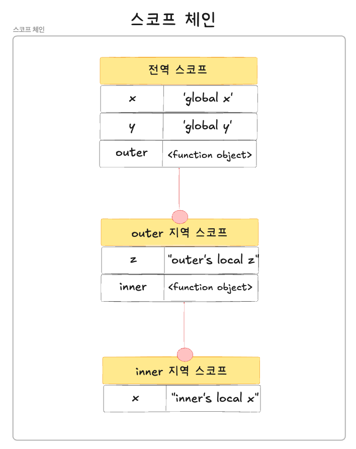

## 스코프

---

### 1. 스코프란?

함수의 매개변수 스코프
- 함수의 매개변수의 스코프 = 함수 내부로 한정됨
```JavaScript
function add(x,y) {
    
    console.log(x,y); // 2 5
}

add(2, 5);

//매개변수는 함수 몸체 내부에서만 참조할 수 있음
console.log(x,y); //RefenceError
```
<br/>

변수는 가장 바깥쪽 뿐만 아닌 코드 블록이나 함수 몸체 내에서도 선언할 수 있으며, 코드 블록이나 함수는 중첩될 수 있음

중첩된 코드 블록이나 함수에서의 변수
```JavaScript
var var1 = 1; //코드의 가장 바깥 영역에서 선언한 변수

if(true){
    var var2 = 2; //코드 블록 내에서 선언한 변수
    if (true) {
        var var3 = 3; //중첩된 코드 블록 내에서 선언한 변수
    }
}

function foo(){
    var var4 = 4; //함수 내에서 선언한 변수
    
    function bar(){
        var var5 = 5; //중첩된 함수 내에서 선언한 변수
    }
}

console.log(var1); //1
console.log(var2); //2
console.log(var3); //3
console.log(var4); //ReferenceError
console.log(var5); //ReferenceError
```
<br/>

스코프 = 식별자가 유효한 범위
- 모든 식별자(변수명, 함수명, 클래스 명)는 선언된 위치에 의한 다른 코드가 식별자 자신을 참조할 수 있는 유효 범위가 결정됨


변수,함수의 스코프에 따른 다른 출력 내용 예시
```JavaScript
var x = 'global';

function foo(){
    var x = 'local';
    console.log(x); //local
}

foo();

console.log(x); //global
```

식별자 결정 = JS엔진은 이름이 같은 두 개의 변수 중 어떤 변수를 참조해야 할 것인지 결정함
- 스코프란 JS엔진이 식별자를 검색할 때 사용하는 규칙이라고도 할 수 있음
- JS엔진은 코드를 실행할 때 코드의 문맥을 고려함

**코드의 문맥과 환경**
- 렉시컬 환경(Lexical Environment) = 코드가 어디서 실행되며 주변에 어떤 코드가 있는지를 의미함
- 컨텍스트(Context) = 코드의 문맥은 렉시컬 환경으로 이루어짐
- 이를 구현한 것이 실행 컨텍스트이며, 모든 코드는 실행 컨텍스트에서 평가되고 실행됨

foo 함수 내부에서 선언된 x 변수
- foo함수 내부에서만 참조할 수 있지만, 외부에서는 참조할 수 없음


<br/>

var 키워드로 선언한 변수의 중복 선언
- var 키워드로 선언된 변수는 같은 스코프 내에서 중복 선언이 허용됨
```JavaScript
function foo(){
    var x = 1;
    var x = 2;
    console.log(x); //2
} 

foo(); //2
```
<br/>

let,const 키워드로 선언된 변수 = 같은 스코프 내에서 중복 선언을 허용하지 않음
```JavaScript
function bar(){
    let x = 1;
    //let이나 const 키워드로 선언된 변수는 같은 스코프 내에서 중복 선언을 허용하지 않음
    let x = 2;
}
bar();
```
<br/>

### 2.스코프의 종류

코드는 전역과 지역으로 구분할 수 있으며, 다음과 같이 스코프와 변수 또한 전역과 지역으로 구분할 수 있음

| 구분 | 설명 | 스코프 | 변수 |
|-----|-----|------|-----|
| 전역 | 코드의 가장 바깥 영역 | 전역 스코프 | 전역 변수 |
| 지역 | 함수 몸체 내부 | 지역 스코프 | 지역 변수 |
<br/>

#### 전역과 전역 스코프

전역 = 코드의 가장 바깥쪽 영역을 의미함
- 변수 선언 시 전역 스코프를 갖는 전역 변수가 생성됨(어디서든 참조할 수 있음)
-> 함수 내부에서도 참조할 수 있음


<br/>

#### 지역과 지역 스코프

지역 = 함수 몸체 내부를 의미
- 변수 선언 시 지역 스코프를 갖는 지역 변수가 생성됨(지역 스코프 내에서만 유효함)
<br/>

### 3.스코프 체인

함수의 중첩 = 함수 몸체 내부에서 함수가 정의된 것
중첩 함수 = 함수 몸체 내부에서 정의한 함수
외부 함수 = 중첩 함수를 포함하는 함수

-> 함수는 중첩될 수 있으므로 함수의 지역 스코프도 중첩될 수 있음

-> 스코프가 함수의 중첩에 의해 계층적 구조를 갖음

스코프 체인 = 스코프가 계층적으로 연결된 것
- JS엔진은 변수를 참조할 때 스코프 체인을 통해 변수를 참조하는 코드의 스코프에서 시작하여 상위 스코프 방향으로 이동하면서 선언된 변수를 검색함

-> 상위 스코프에서 선언한 변수를 하위 스코프에서도 참조할 수 있음




스코프 체인은 물리적으로 존재하며, JS엔진은 코드를 실행하기에 앞서 렉시컬 환경을 실제로 생성함
- 변수 선언이 실행되면 변수 식별자가 해당 자료구조(렉시컬 환경)에 키(key)로 등록됨
- 변수에 값 할당 시 해당 변수 식별자에 해당하는 값을 변경함

렉시컬 환경(Lexical Environment)
- 스코프 체인 = 실행 컨텍스트의 렉시컬 환경을 단방향으로 연결한 것
- 전역 렉시컬 환경 = 코드가 로드되면 곧바로 생성됨
- 함수의 렉시컬 환경 = 함수가 호출되면 곧바로 생성됨
<br/>

#### 1. 스코프 체인에 의한 변수 검색

상위 스코프에서 유효한 변수는 하위 스코프에서 자유롭게 참조할 수 있지만, 하위 스코프에서 유효한 변수를 상위 스코프에서 참조할 수 없음

#### 2.스코프 체인에 의한 함수 검색

전역에서 정의된 foo함수와 bar함수 내부에서 정의된 foo함수
- 함수 선언문으로 함수를 정의 시 런타임 이전에 함수 객체가 먼저 생성됨
- JS엔진은 함수 이름과 동일한 이름의 식별자를 암묵적으로 선언하고 함수 객체를 할당함
```JavaScript
//전역 함수
function foo(){
    console.log('global function foo');
}

function bar(){
    //중첩 함수
    function foo(){
        console.log('local function foo');
    }
  foo(); //local function foo
}

bar();
```
<br/>

### 4. 함수 레벨 스코프

지역 = 함수 몸체 내부
- 함수에 의해서만 지역 스코프가 생성됨
- var로 선언된 변수는 오직 함수의 코드 블록(함수 몸체)만을 지역 스코프로 인정함

-> 이를 함수 레벨 스코프라고함

함수 레벨 스코프
- 먼저 선언된 var 변수가 전역으로 선언됨
- 값 변경 후라도 var 변수는 전역임
```JavaScript
var x = 1;

if(true) {
    var x = 10;
}

console.log(x); //10
```
<br/>

for 문
- 먼저 선언된 var 변수는 전역임으로 for문 밖에서 출력 시 변경된 값을 출력됨
- 전역 변수로 처리됨
```JavaScript
var i = 10;

for(var i = 0; i < 5; i++){
    console.log(i); //0 1 2 3 4
}

console.log(i);
```
<br/>

### 5. 렉시컬 스코프

렉시컬 스코프의 예시
- 실행 결과는 bar 함수의 상위 스코프가 무엇인지에 따라 결정됨
1. 함수를 어디서 호출했는지에 따라 함수의 상위 스코프를 결정함
   - bar함수의 상위 스코프는 foo함수의 지역 스코프와 전역 스코프임
    - 동적 스코프 = 함수가 정의하는 시점에는 함수가 어디에 호출될 수 없음
    - 따라서 함수가 호출되는 시점에 동적으로 상위 스코프를 결정해야 함

2. 함수를 어디서 정의했는지에 따라 함수의 상위 스코프를 결정함
   - bar 함수의 상위 스코프는 전역 스코프임
   - 렉시컬 스코프, 정적 스코프 = 함수 정의가 평가되는 시점에 상위 스코프가 정적으로 결정되기 때문
   - JS는 렉시컬 스코프를 따름

렉시컬 스코프의 예시
- bar 함수의 상위 스코프는 전역 스코프를 가진 var 변수임
```JavaScript
var x = 1;

function foo(){
    var x = 10;
    bar();
}

function bar(){
    console.log(x);
}

foo(); //1
bar(); //1
```
<br/>

정리
- JS는 렉시컬 스코프를 따르므로 함수가 어디서 호출했는지가 아닌 함수를 어디서 정의했는지에 따라 상위 스코프를 결정함
- 함수가 호출된 위치는 상위 스코프 결정에 어떠한 영향도 주지 않음
- 함수의 상위 스코프는 함수가 정의될 때 정적으로 결정되며
- 생성된 함수 객체는 결정된 상위 스코프를 기억함
