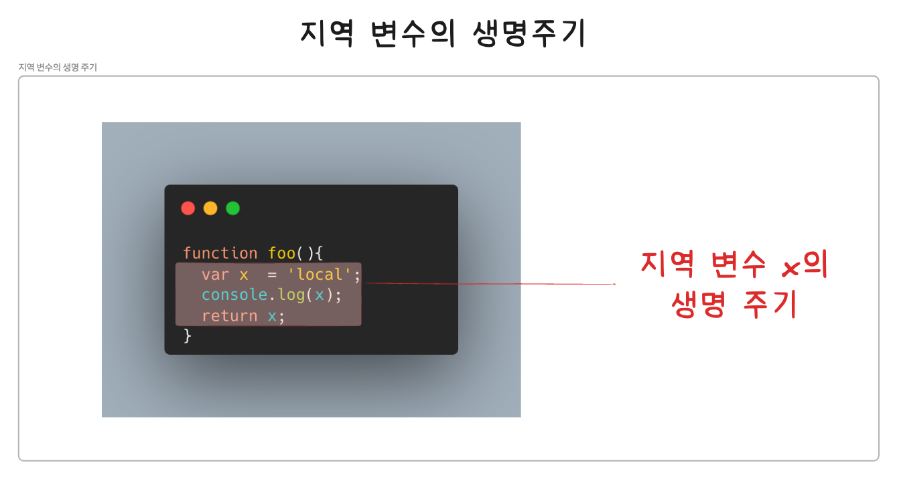
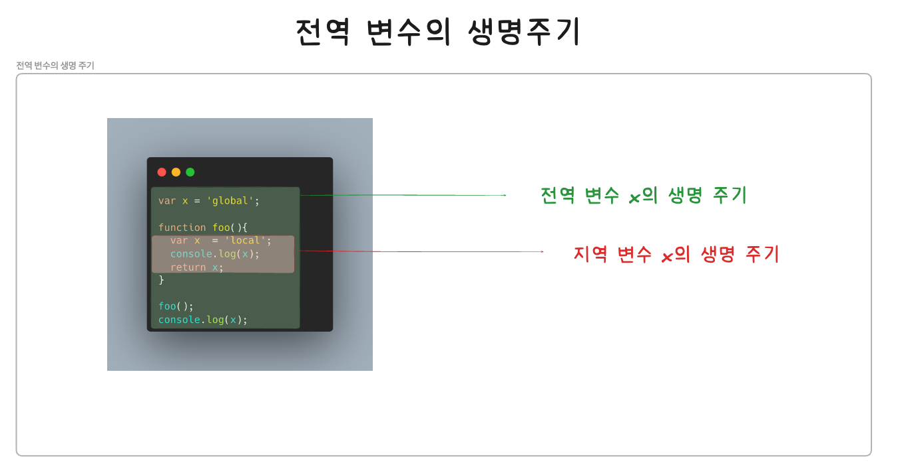

## 전역 변수의 문제점

---

### 1. 변수의 생명 주기

#### 1. 지역 변수의 생명 주기

지역 변수
- 지역 변수 x는 foo함수가 호출되기 이전까지는 생성되지 않음
- 호이스팅에 의해 변수 선언은 런타임 이전에 먼저 실행되지만 접근은 해당 스코프를 따름
- 지역 변수 x는 foo함수가 호출 될때 호이스팅에 의해 undefined가 되고, 이후 순차적으로 값이 할당됨
- 지역 변수의 생명주기는 함수의 생명 주기와 일치함(스코프)
```JavaScript
function foo(){
    const x = 'local';
    console.log(x); //local
    return x;
}

foo();
console.log(x); //ReferenceError
```
<br/>



<br/>

예시
- foo함수 내에서 선언된 지역 변수 x는 이미 선언되었으며 undefined로 값을 출력
- 변수 선언이 먼저 호이스팅되어 해당 스코프 내에서 변수 x는 undefined로 값을 출력함
- 호이스팅 = 변수 선언이 스코프의 선두로 끌어 올려진 것처럼 동작하는 JS의 특징
```JavaScript
var x = 'global';

function foo(){
    console.log(x); //undefined
    var x = 'local';
    console.log(x); //local
}

foo();
console.log(x); //global
```

#### 2. 전역 변수의 생명 주기

함수의 호출 없이 코드가 로드되자마자 곧바로 해석되고 실행됨
- 함수는 함수 몸체의 마지막 문 또는 반환문이 실행되면 종료됨
- 전역 코드에는 반환문을 사용할 수 없으므로 마지막 문이 실행되어 더 이상 실행할 문이 없을 때 종료함
- var 키워드로 선언한 전역 변수는 전역 객체의 프로퍼티가 됨(전역 변수의 생명주기가 전역 객체의 생명 주기와 일치함)

전역 객체(global object)
- 코드 실행 이전 JS엔진에 의해 어떤 객체보다도 먼저 생성되는 특수한 객체
- 전역 객체는 브라우저(클라이언트 사이드 환경)에서는 window, 서버 사이드 환경(Node.js)에서는 global 객체를 의미함
- 환경에 따라 전역 객체를 가리키는 다양한 식별자(window, self, this, frames, global)가 존재 했으나 ES11에서 globalThis로 통일됨
- 전역 객체는 표준 빌트인 객체(Object,String, Number, Function, Array)와 환경에 따른 호스트 객체(클라이언트 Web API또는 Node.js의 호스트 API), var 키워드로 선언한 전역 변수와 전역 함수를 프로퍼티로 갖음

브라우저 환경에서 전역 객체는 window임으로 브라우저 환경에서 선언한 var키워드의 전역 변수는 전역 객체 window의 프로퍼티임
- 전역 개체 window는 웹 페이지를 닫기 전까지 유효함
- var키워드로 선언한 전역 변수의 생명주기는 전역 객체의 생명주기와 일치함
<br/>



### 2.전역 변수의 문제점

1. 암묵적 결합
전역 변수를 선언한 의도는 전역, 코드를 어디서든 참조하고 할당할 수 있는 변수를 사용하겠다는 의미임
- 이는 모든 코드가 전역 변수를 참조하고 변경할 수 있는 암묵적 결합을 허용한다는 의미임
- 변수의 유효범위가 크면 코드의 가독성은 나빠지고 의도치 않게 상태가 변경될 수 있는 위험성도 높아짐

2. 긴 생명 주기
전역 변수는 생명 주기가 길며, 메모리 리소스 또한 오랜 기간 소비함
- 변수의 값이 실수로 재할당이 이루어질 수 있음

```JavaScript
var x = 1;

//...

//변수의 중복 선언
var x = 100;
console.log(x); //100
```
<br/>

3. 스코프 체인 상에서 종점에 존재
전역 변수는 스코프 체인 상 최상위에 위치함
- 변수를 검색할 때 전역 변수가 가장 마지막으로 검색됨
- 전역 변소의 검색 속도가 가장 느림

4. 네임스페이스 오염
JS는 파일이 분리되어 있다고 해도 하나의 전역 스코프를 공유함
- 다른 파일 내에서 동일한 이름으로 명명된 전역 변수나 전역 함수가 같은 스코프 내에 존재할 경우 에러가 발생할 수 있음
<br/>

### 3.전역 변수의 사용을 억제하는 방법

전역 변수를 반드시 사용해야 할 이유를 찾지 못한 경우 지역 변수를 사용해야 함
- 변수의 스코프는 좁을수록 좋음

### 즉시 실행 함수
즉시 실행 함수 = 함수와 동시에 호출되는 즉시 단 한번만 호출됨
- 모든 코드를 즉시 실행 함수로 감싸면 모든 변수는 즉시 실행 함수의 지역 변수가 됨
- 라이브러리 등에서 자주 사용됨

```JavaScript
(function () {
    var foo = 10; //즉시 실행 함수의 지역 변수
    ...
}());

console.log(foo); //ReferenceError
```
<br/>

#### 네임 스페이스 객체
전역에 네임스페이스 역할을 담당할 객체를 생성하고 전역 변수처럼 사용하고 싶은 변수를 프로퍼티로 추가하는 방법

```JavaScript
var MYAPP = {}; //전역 네임스페이스 객체

MYAPP.name = 'Lee';

console.log(MYAPP.name); //Lee
```
<br/>

네임스페이스 객체에 또 다른 네임 스페이스 객체를 프로퍼티로 추가하여 네임 스페이스를 계층적으로 구성할 수 있음

```JavaScript
var MYAPP = {}; //전역 네임스페이스 객체

MYAPP.person = {
    name: 'Lee',
    address:  'Seoul'
};

console.log(MYAPP.person.name); //Lee
```
<br/>

네임스페이스를 분리하여 식별자 충돌을 방지하는 효과는 있으나 네임 스페이스 객체 자체가 전역 변수에 할당됨으로 유용하지 않음

#### 모듈 패턴

모듈 패턴 = 클래스를 모방하여 관련이 있는 변수와 함수를 모아 즉시 실행 함수로 감싸 하나의 모듈을 만듬
- 클로저를 기반으로 동작함
- 전역 변수의 억제와 함께 캡슐화까지 구현 가능함

캡슐화 = 객체의 상태를 나타내는 프로퍼티와 프로퍼티를 참조하고 조작할 수 있는 동작인 메서드를 하나로 묶는 것을 의미함
- 정보 은닉 = 객체의 특정 프로퍼티나 메서드를 감출 목적으로 사용하기도 함
- JS는 public, private, protected 등의 접근 제한자를 제공하지 않음

모듈 패턴
- 즉시 실행 함수는 객체를 반환함
- 해당 객체에는 외부에 노출하고 싶은 변수나 함수를 담아 반환함
- 반환되는 객체의 프로퍼티는 외부에 노출되는 퍼블릭 멤버임
- 외부로 노출하고 싶지 않은 변수나 함수는 반환하는 객체에 추가하지 않으면 접근할 수 없는 프라이빗 멤버가 됨
```JavaScript
var Counter = (function (){
    //private 변수
    var num = 0;
    
    //외부로 공개할 데이터나 메서드를 프로퍼티로 추가한 객체를 반환함
    return {
        increase(){
        return ++num;
        },
    decrease(){
        return --num;
        }
    };
}());

//private 변수는 외부로 노출되지 않음
console.log(Counter.num); //undefined

console.log(Counter.increase()); //1
console.log(Counter.increase()); //2
console.log(Counter.decrease()); //1
console.log(Counter.decrease()); //0
```
<br/>

#### ES6 모듈

ES6 모듈 사용 시 전역 변수를 사용할 수 없음
- ES6모듈은 파일 자체의 독자적인 모듈 스코프를 제공함
- 모듈 내 var 키워드로 선언한 변수는 더 이상 전역 변수가 아니며, window 객체의 프로퍼티도 아님

모던 브라우저(크롬, 엣지)등에서 ES6모듈을 사용할 수 있음
- script 태그에 type = "module" 어트리뷰트를 추가하면 로드된 JS 파일은 모듈로서 동작함
- 모듈의 파일 확장자는 mjs로 사용함

```JavaScript
<script type = "module" src = "lib.mjs"></script>
<script type = "module" src = "app.mjs"></script>
```
<br/>