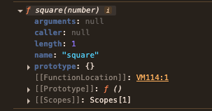
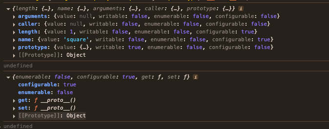

## 함수와 일급 객체

---

### 1. 일급 객체

일급 객체의 조건

1. 무명의 리터럴로 생성할 수 있음
- 런타임에 생성이 가능함

2. 변수나 자료구조(객체, 배열 등)에 저장할 수 있음

3. 함수의 매개변수에 전달할 수 잇음

4. 함수의 반환값으로 사용할 수 있음

JS의 함수는 예제와 같이 위의 조건을 모두 만족함으로 일급 객체임

```JavaScript
// 1. 함수는 무명의 리터럴로 생성할 수 잇음

// 2. 함수는 변수에 저장할 수 있음
//런타임(할당 단계)에 함수 리터럴이 평가되어 함수 객체가 생성되고 변수에 할당됨
const increase = function (num) {
    return ++num;
};

const decrease = function (num) {
    return --num;
};

//2.함수는 객체에 저장할 수 있음
const auxs = { increase, decrease };

// 3. 함수의 매개변수에 전달할 수 있음
// 4. 함수의 반환값으로 사용할 수 있음
function makeCounter(aux) {
    let num = 0;
    
    return function () {
        num = aux(num);
        return num;
    };
}

// 3. 함수는 매개변수에게 함수를 전달할 수 있음
const increaser = makeCounter(auxs.increase);
console.log(increaser()); //1
console.log(increaser()); //2

// 3. 함수는 매개변수에게 함수를 전달할 수 있음
const decreaser = makeCounter(auxs.decrease);
console.log(decreaser()); //-1
console.log(decreaser()); //-2
```

함수가 일급객체라는 의미
- 함수를 객체와 동일하게 사용할 수 있다는 의미
- 객체는 값임으로 함수는 값과 동일하게 취급할 수 있음
- 함수는 값을 사용할 수 있는 곳(변수 할당문, 객체의 프로퍼티 값, 배열의 요소, 함수 호출의 인수, 함수 반환문)이라면 어디서든 리터럴로 정의할 수 있음
- 런타임에 함수 객체로 평가됨

일급 객체로서 함수가 가지는 가장 큰 특징
- 일반 객체와 같이 함수의 매개변수에 전달할 수 있으며, 함수의 반환값으로 사용할 수도 있음
- 이는 함수형 프로그래밍을 가능케하는 JS의 장점임

함수는 객체이지만, 일반 객와는 차이가 존재함

| 일반 객체 | 함수 객체 |
|---------|--------|
| 호출이 불가함 | 호출이 가능함 |
| 함수의 프로퍼티가 없음 | 함수 고유의 프로퍼티를 소유함 |
<br/>

### 2. 함수 객체의 프로퍼티

함수 = 객체
- 함수도 프로퍼티를 가질 수 잇음

브라우저 콘솔에서 console.dir 메서드를 사용해서 함수 객체의 내부를 살펴본 예시
```JavaScript
function square(number) {
    return number * number;
}

console.dir(square);
```



square 함수의 모든 프로퍼티의 프로퍼티 어트리뷰트를 Object.getOwnPropertyDescriptors 메서드로 확인한 예시

```JavaScript
function square(number) {
    return number * number;
}

console.log(Object.getOwnPropertyDescriptors(square));

//__proto__는 square 함수의 프로퍼티가 아님
console.log(Object.getOwnPropertyDescriptor(square, '__proto__')); //undefined

//__proto__는 Object.prototype 객체의 접근자 프로퍼티임
//square 함수는 Object.prototype 객체로부터 __proto__ 접근자 프로퍼티를 상속받음
console.log(Object.getOwnPropertyDescriptor(Object.prototype, '__proto__'));
```



이처럼 arguments, caller, length, name, prototype 프로퍼티는 모두 함수 객체의 데이터 프로퍼티임
- 해당 프로퍼티는 일반 객체에 없는 함수 객체 고유의 프로퍼티임
- 하지만 ```__proto__```는 접근자 프로퍼티이며, 함수 객체 고유의 프로퍼티가 아닌 Object.prototype 객체의 프로퍼티를 상속받은 것을 알 수 있음
- ```Object.prototype``` 객체의 프로퍼티는 모든 객체가 상속받아 사용할 수 있음


#### arguments 프로퍼티

함수 객체의 arguments 프로퍼티 값은 arguments 객체임

arguments 객체
- 함수 호출 시 전달된 인수들의 정보를 담고 있는 순회 가능한 유사 배열 객체이며, 함수 내부에서 지역 변수처럼 사용됨
- 함수 외부에서는 참조할 수 없음
- 함수 객체의 arugments프로퍼티는 현재 일부 브라우저에서 지원하고 있지만, ES3부터 표준에서 폐지되어 Function.arguments 사용법은 권장되지 않음
- 함수 내부에서 지역 변수처럼 사용할 수 있는 arguments 객체를 참조하여 사용함

JS는 함수의 매개변수와 인수의 갯수가 일치하는지 확인하지 않음
- 함수 호출 시 매개변수 갯수만큼 인수를 전달하지 않아도 에러가 발생하지 않음

```JavaScript
function multiply(x,y){
    console.log(arguments);
    return x * y;
}

console.log(multiply()); //NaN
console.log(multiply(1)); //NaN
console.log(multiply(1,2)); //2
console.log(multiply(1,2,3)); //2
```

함수를 정의할 때 선언한 매개변수는 함수 몸체 내부에서 변수와 동일하게 취급됨
- 함수가 호출되면 함수 몸체 내에서 암묵적으로 매개변수가 선언되고 undefined로 초기화된 이후 인수가 할당됨
- 선언된 매개변수의 갯수보다 인수를 적게 전달했을 경우(multiply(),multiply(1)) 인수가 전달되지 않은 매개변수는 undefined로 초기화된 상태를 유지함
- 매개변수의 갯수보다 인수를 더 많이 전달한 경우, 초과된 인수는 무시됨
- 초과된 인수는 arguments 객체의 프로퍼티에 보관됨

브라우저 콘솔로 실행한 예시


arguments 객체는 인수를 프로퍼티 값으로 소유하며 프로퍼티 키는 인수의 순서를 나타냄
- arguments 객체의 callee 프로퍼티는 호출되어 arguments 객체를 생성한 함수(함수 자신이 가리키고 arguments 객체의 length 프로퍼티는 인수의 개수를 가리킴)

선언된 매개변수의 개수와 함수를 호출할 때 전달하는 인수의 개수를 확인하지 않는 JS의 특징 때문에 함수가 호출되면 인수 개수를 확인하고 이에 따라 함수의 동작을 달리 정의할 필요가 있음

이때 유용하게 사용되는 것이 arguments 객체임

arguments 객체
- 매개변수 개수를 확정할 수 없는 가변 인자 함수를 구현할 때 유용함
- 배열 형태로 인자 정보를 담고 있지만 실제 배열이 아닌 유사 배열 객체임

```JavaScript
function sum() {
    let res = 0;

    //arguments 객체는 length 프로퍼티가 잇는 유사 배열 객체임으로 for문으로 순회 가능
    for(let i = 0; i < arguments.length; i++) {
        res += arguments[i];
    }
    return res;
}

console.log(sum()); //0
console.log(sum(1,2)); //3
console.log(sum(1,2,3)); //6
```

유사 배열 객체
- length 프로퍼티를 가진 객체로 for문으로 순회할 수 있는 객체를 의미함
- 유사 배열 객체는 배열이 아니므로 배열 메서드를 사용할 경우 에러가 발생함
- 따라서 배열 메서드를 사용하려면 Function.prototype.call, Function.prototype.apply를 사용해 간접 호출해야 하는 번거로움이 존재함

유사 배열 객체와 이터러블
- ES6에서 도입된 이터레이블 프로토콜을 준수하며 순회 가능한 자료구조인 이터러블이 됨
- 이터러블의 개념이 없었던 ES5에서 arguments 객체는 유사 배열 객체로 구분됨
- 이터러블이 도입된 ES6에서 arguments 객체는 유사 배열 객체이면서 동시에 이터러블임

```JavaScript
function sum () {
    //arguments 객체를 배열로 변환
    const array = Array.prototype.slice.call(arguments);
    return array.reduce(function (pre, cur){
        return pre + cur;
    },0);
}

console.log(sum(1,2)); //3
console.log(sum(1,2,3,4,5)); //15
```

이러한 번거로움을 해결하기 위해 ES6에서 Rest 파라미터를 도입함
- ES6 Rest 파라미터 도입으로 JS의 arguments 객체의 중요성은 떨어졌으나 알아둘 필요가 있음
```JavaScript
//ES6 Rest parameter
function sum(...args) {
    return args.reduce((pre, cur) => pre + cur, 0);
}

console.log(sum(1,2)); //3
console.log(sum(1,2,3,4,5)); //15
```

#### caller 프로퍼티

caller 프로퍼티는 ESMAScript 사양에 포함되지 않은 비표준 프로퍼티임
- 이후 표준화될 예정이 없는 프로퍼티임으로 참고로 알아둠

함수 객체의 caller 프로퍼티는 함수 자신을 호출한 함수를 가리킴

함수 호출 foo(bar)의 경우
- bar 함수를 foo 함수 내에서 호출함
- bar 함수의 caller 프로퍼티는 bar 함수를 호출한 foo 함수를 가리킴

함수 호출 bar()의 경우
- bar 함수를 호출한 함수는 없음
- 따라서 caller 프로퍼티는 null을 가리킴

브라우저에서 실행한 결과이며, Node.js 환경에서 예제를 실행하면 다른 결과가 나옴(모듈과 관계가 있음)

```JavaScript
function foo(func) {
    return func();
}

function bar(){
    return 'caller: ' + bar.caller;
}

//브라우저에서 실행한 결과
console.log(foo(bar)); //caller :function foo(func) {...}
console.log(bar()); //caller: null
```

#### length 프로퍼티

함수 객체의 length 프로퍼티는 함수를 정의할 때 선언한 매개변수의 개수를 가리킴
```JavaScript
function foo(){
console.log(foo.length); //0

function bar(x) {
    return x;
}
console.log(bar.length); //1

function baz(x,y) {
    return x * y;
}
console.log(baz.length); //2
}
```

주의 사항
- arguments 객체의 length 프로퍼티와 함수 객체의 length 프로퍼티의 값은 다를 수 있으므로 주의해야 함
- arguments 객체의 length 프로퍼티 = 인자의 개수를 가리킴
- 함수 객체의 length 프로퍼티 = 매개변수의 갯수를 가리킴


#### name 프로퍼티

함수 객체의 name 프로퍼티는 함수 이름을 나타냄
- name 프로퍼티는 ES6 이전까지는 비표준이였다가 ES6에서 정식 표준이 됨
- name 프로퍼티는 ES5와 ES6에서 동작을 달리함

ES5에서의 name 프로퍼티
- 익명 함수 표현식의 경우, name 프로퍼티는 빈 문자열을 값으로 가짐

ES6에서의 name 프로퍼티
- 함수 객체를 가리키는 식별자를 값으로 가짐

```JavaScript
//기명 함수 표현식
var namedFunc = function foo(){};
console.log(namedFunc.name); //foo

//익명 함수 표현식
var anonymousFunc = function(){};
// ES5: name 프로퍼티는 빈 문자열을 값으로 가짐
// ES6: name 프로퍼티는 함수 객체를 가리키는 변수 이름을 값으로 가짐
console.log(anonumousFunc.name); //anonymousFunc

//함수 선언문(Funciton declaration)
function bar(){}
console.log(bar.name); //bar
```

주의해야 할 점
- 함수 이름과 함수 객체를 가리키는 식별자는 의미가 서로 다름
- 함수 호출할 때는 함수명이 아닌 함수 객체를 가리키는 식별자로 호출함

#### __proto__ 접근자 프로퍼티

모든 객체는 [[Prototype]]이라는 내부 슬롯을 가짐

[[Prototype]] 내부 슬롯
- 객체지향 프로그래밍의 상속을 구현하는 프로토타입 객체를 가리킴
- __proto__ 프로퍼티는 [[Prototype]] 내부 슬롯이 가리키는 프로토타입 객체에 접근하기 위해 사용하는 접근자 프로퍼티임
- 내부 슬롯에는 직접 접근할 수 없고, 간접적인 접근 방법을 제공하는 경우에 한하여 접근할 수 있음
- [[Prototype]] 내부 슬롯에도 직접 접근할 수 없으며, __proto__ 접근자 프로퍼티를 통해 간접적으로 프로토타입 객체에 접근할 수 있음

```JavaScript
const obj = { a: 1};

//객체 리터럴 방식으로 생성한 객체의 프로토타입 객체는 Object.prototype임
console.log(obj.__proto__ === Object.prototype); //true

//객체 리터럴 방식으로 생성한 객체는 프로토타입 객체인 Object.prototype의 프로퍼티를 상속받음
//hasOwnProperty 메서드는 Object.prototype의 메서드임
console.log(obj.hasOwnProperty('a')); //true
console.log(obj.hasOwnProperty('__proto__')); //false
```

hasOwnProperty 메서드
- 이름에서 알 수 있듯이 인수로 전달받은 프로퍼티 키가 객체 고유의 프로퍼티 키인 경우에만 true를 반환하고, 상속받은 프로토타입의 프로퍼티 키인경우 false를 반환함

### prototype 프로퍼티

prototype 프로퍼티는 생성자 함수로 호출할 수 있는 함수 객체 = constructor만이 소유하는 프로퍼티임
- 일반 객체와 생성자 함수로 호출할 수 없는 non-constructor에는 prototype 프로퍼티가 없음

```JavaScript
//함수 객체는 prototype 프로퍼티를 소유함
(function () {}).hasOwnProperty('prototype'); //true

//일반 객체는 prototype 프로퍼티를 소유하지 않음
({}).hasOwnProperty('prototype'); //false
```

prototype 프로퍼티는 함수가 객체를 생성하는 생성자 함수로 호출될 때 생성자 함수가 생성할 인스턴스의 프로토타입 객체를 가리킴