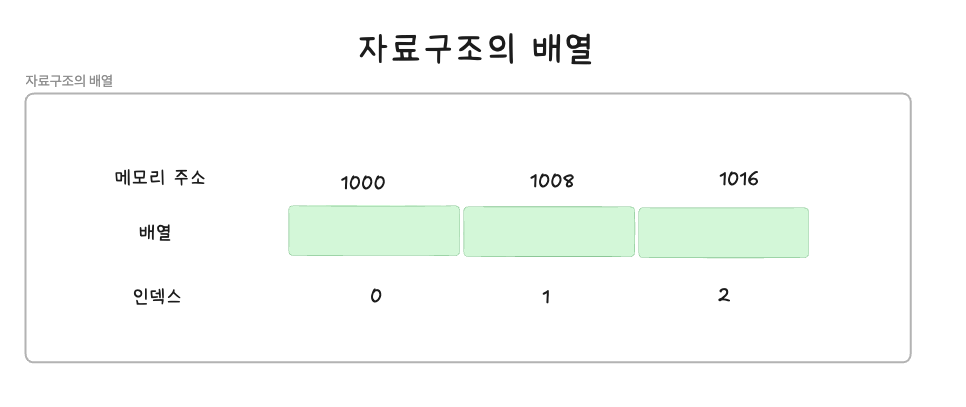

## 배열

---

### 1. 배열이란?

배열 = 여러 개의 값을 순차적으로 나열한 자료구조
- JS에서 배열은 같은 값이 아니라도 배열로 생성할 수 있음
- JS에서 원시값, 객체, 함수, 배열 등 모든 값에 대해서 배열의 요소로 지정할 수 있음

배열 리터럴
- 배열의 값 = 요소
- 배열의 요소는 인덱스를 가짐(0 이상의 정수)
```JavaScript
const arr = ['apple', 'banana', 'orange'];
```

배열 접근
- 대괄호 표기법을 사용함
- 대괄호 내 인덱스를 지정함

```JavaScript
arr[0] //'apple'
arr[1] //'banana'
arr[2] //'orange' 
```

배열의 길이
- 배열은 요소의 개수, 즉 배열의 길이를 나타내는 length 프로퍼티를 가짐

```JavaScript
arr.length //3 
```

배열의 순회
- 배열은 인덱스와 length 프로퍼티를 갖기 때문에 for문을 통해 순차적으로 요소 접근이 가능함

```JavaScript
//배열의 순회
for(let i = 0; i < arr.length; i++){
    console.log(arr[i]); // 'apple' 'banana' 'orange'
}
```

JS 내에서 배열은 객체 타입임
```JavaScript
typeof arr //object
```

배열 생성
- 배열은 배열 리터럴, Array 생성자 함수, Array.of, Array.from 메소드로 생성할 수 있음
- 배열 생성자 함수 = Array
- 배열의 프로토 타입 객체 = Array.prototype
  - Array.prototype은 배열을 위한 빌트인 메서드를 제공함

```JavaScript
const arr = [1,2,3];

arr.constructor === Array //true
Object.getPrototypeOf(arr) === Array.prototype //true
```

일반 객체와 배열의 구분
- 배열은 객체이지만, 일반 객체와 달리 특징이 존재함
- 배열은 값의 순서와 length 프로퍼티가 존재함

| 구분 | 객체 | 배열 |
|-----|-----|-----|
| 구조 | 프로퍼티 키와 프로퍼티 값 | 인덱스와 요소 |
| 값의 순서 | X | O |
|length 프로퍼티 | X | O |


배열의 장점
- 처음부터 순차적으로 요소에 접근할 수 있으며, 역순으로 접근할 수 있음
- 특정 위치로부터 순차적 요소에 접근할 수 있음
<br/>

### 2. 자바스크립트 배열은 배열이 아니다.

자료구조에서 말하는 배열 = 동일한 크기의 메모리 공간이 빈틈없이 연속적으로 나열된 자료구조를 의미함 = 밀집 배열
- 배열은 각 요소가 동일한 데이터 크기를 가지며, 연속적으로 이어져 잇음



장점: 배열은 인덱스를 통해 효율적으로 접근할 수 있음
인덱스를 통해 배열의 요소에 접근 = O(1)

단점: 정렬되지 않은 배열에서 특정 요소를 검색하는 경우, 특정 요소를 발견할 때까지 차례로 검색 = O(n)
배열 중간에 요소를 삽입하거나 삭제하는 경우, 배열의 요소를 이동시켜야 함 = O(n)

```JavaScript
//선형 검색을 통해 배열(array)에 특정 요소(target)이 존재하는지 확인함
//배열에 특정 요소가 존재한다면 특정 요소의 인덱스를 반환하고, 존재하지 않으면 -1을 반환함
function linearSearch(array, target){
  const length = array.length;
  
  for(let i = 0; i<length; i++){
    if(array[i] === target) return i;
  }
  
  return -1;
}

console.log(linearSearch([1,2,3,4,5,6],3)); //2
console.log(linearSearch([1,2,3,4,5,6],0)); //-1
```

JS의 배열 = 희소 배열
- 자료 구조에 배열과 달리 동일한 메모리 공간의 크기를 갖지 않아도 되며, 연속적으로 이어지지 않아도 됨
- JS의 배열은 일반적인 배열의 동작을 흉내 낸 객체임
```JavaScript
console.log(Object.getOwnPropertyDescriptors([1, 2, 3]));
/*
｛
'0': {value: 1, writable: true, enumerable: true, configurable: true}
'1': {value: 2, writable: true, enumerable: true, configurable: true}
'2': {value: 3, writable: true, enumerable: true, configurable: true}
 length: {value: 3, writable: true, enumerable: false, configurable: false}
}
*/
```

JS의 배열은 인덱스를 나타내는 문자열을 프로퍼티 키로 가지며, length 프로퍼티를 갖는 객체임
- 배열의 요소 = 프로퍼티 ㄱ밧임
- JS에서 사용할 수 있는 모든 값은 객체의 프로퍼티 값이 될 수 있으므로 어떤 타입의 값이라도 배열의 요소가 될 수 있음

```JavaScript
const arr = [
  'string',
  10,
  true,
  null,
  undefined,
  NaN,
  Infinity,
  [ ],
  { },
  function () {}
];
```

일반적인 배열과  JS의 배열의 장단점 정리

일반적인 배열
- 인덱스로 요소에 빠르게 접근할 수 있음
- 중간에 요소를 삽입하거나 삭제하는 경우에 효율적이지 않음

JS 배열
- 해시 테이블로 구현된 객체이므로 인덱스로 요소에 접근하는 경우 일반적인 배열보다 성능적인 면에서 느릴 수 밖에 없음
- 중간에 요소를 삽입하거나 삭제하는 경우 일반적인 배열보다 빠른 성능을 기대할 수 있음


<br/>

### 3. length 프로퍼티와 희소  배열

length 프로퍼티는 요소의 개수를 나타냄
- length 프로퍼티 값은 빈 배열일 경우 0이며, 빈 배열이 아닐 경우 가장 큰 인덱스에 1을 더한 것과 같음

```JavaScript
[].length //0
[1,2,3].length //3
```

length 프로퍼티의 값은 배열에 요소를 추가하거나 삭제하면 자동 갱신됨
```JavaScript
const arr = [1,2,3];
console.log(arr.length); //3

//요소 추가
arr.push(4);

//요소를 추가하면 length 프로퍼티의 값이 자동 갱신됨
console.log(arr.length); //4

//요소 삭제
arr.pop();

//요소를 삭제하면 length 프로퍼티의 값이 자동 갱신됨
console.log(arr.length); //3


```


<br/>

### 4. 배열 생성


#### 배열 리터럴


#### Array 생성자 함수


#### Array.of


#### Array.from


<br/>

### 5. 배열 요소의 참조


<br/>


### 6. 배열 요소의 추가와 갱신


<br/>


### 7. 배열 요소의 삭제

<br/>

### 8. 배열 메서드

#### Array.isArray

#### Array.prototype.indexOf

#### Array.prototype.push


#### Array.prototype.pop


#### Array.prototype.unshift


#### Array.prototype.shift


#### Array.prototype.concat


#### Array.prototype.splice


#### Array.prototype.join


#### Array.prototype.reverse


#### Array.prototype.fill


#### Array.prototype.includes


#### Array.prototype.flat


<br/>

### 9. 고차 함수

#### Array.prototype.sort


#### Array.prototype.forEach


#### Array.prototype.map


#### Array.prototype.filter


#### Array.prototype.reduce

#### Array.prototype.som


#### Array.prototype.every


#### Array.prototype.find


#### Array.prototype.findIndex

#### Array.prototype.flatMap
