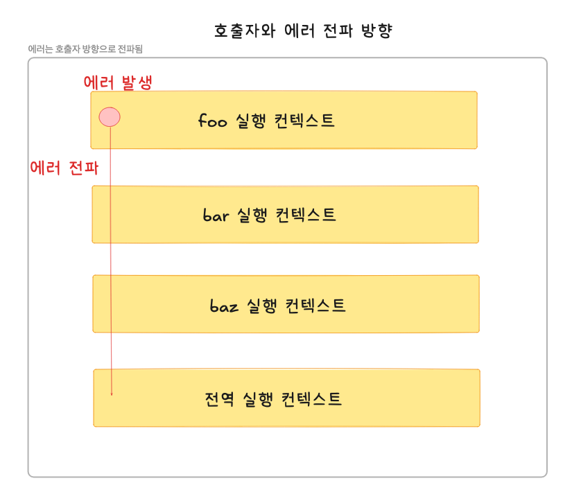

## 에러 처리

---

### 1. 에러 처리의 필요성

에러가 발생하지 않는 코드는 작성하는 것이 불가능하며 언제나 에러를 대처하도록 해야함

```JavaScript
console.log('[Start]');

//발생된 에러를 방치하면 프로그램은 강제 종료됨
foo(); //ReferenceError: foo is not defined

//에러에 의해 다음의 코드는 실행되지 않음
console.log('[End]');
```

try ~ catch문을 사용하여 발생한 에러에 적절하게 대응하면 프로그램이 강제 종료되지 않고 계속해서 코드를 실행할 수 있음
```JavaScript
console.log('[Start]');

try{
    foo();
} catch (error) {
    console.error('[에러 발생]', error);
    //[에러 발생] ReferenceError: foo is not defined
}

//발생한 에러에 대해서 대응하면 다음의 코드는 실행되고 프로그램이 강제 종료되지 않음
console.log('[End]');
```

직접적으로 에러를 발생하지 않는 예외적인 상황이 발생할 수도 잇음
- 예외적인 상황에 적절하게 대응하지 않으면 에러로 이어질 가능성이 큼
- querySelector 메서드는 인수로 전달한 CSS 선택자 문자열로 DOM에서 요소 노드를 찾을 수 없는 경우 에러를 발생시키지 않고 null을 반환함
```JavaScript
//DOM에 button 요소가 존재하지 않으면 querySelector 메서드는 에러를 발생시키지 않고 null을 반환함
const $button = document.querySelector('button'); //null

$button.classList.add('disabled'); //TypeError: Cannot read property 'classList' of null
```

- querySelector 메서드는 인수로 전달한 문자열이 CSS 선택자 문법에 맞지 않는 경우 에러를 발생시킴
```JavaScript
const $elem = document.querySelector('#1'); //DOM Exception: Failed to exectue querySelector on Document: #1 is not a valid selector
```

querySelector 메서드가 인수로 전달한 CSS 선택자 문자열로 DOM에서 요소 노드를 찾을 수 없는 경우 에러를 발생시키지 않고 null을 반환하는 경우
- if문으로 querySelector 메서드의 반환값을 확인하거나 단축 평가 또는 옵셔널 체이닝 연산자 ?.를 사용하지 않으면 에러로 이어질 가능성이 큼

수정한 JS
```JavaScript
const $button = document.querySelector('button'); //null
$button?.classList.add('disabled');
```
<br/>

### 2.try ~ catch ~ finally문

에러 처리를 구현하는 방법 = 크게 2가지가 존재함
1. querySelector나 Array#find 메서드처럼 예외적인 상황이 발생하면 반환하는 값(null 또는 -1)을 if문이나 단축 평가 또는 옵셔널 체이닝 연산자를 통해 확인하여 처리하는 방법
2. 에러 처리 코드를 미리 등록해두고 에러가 발생되면 에러 처리 코드로 점프하도록하는 방법
   - try ~ catch ~ finally 문(예외 처리)

try ~ catch ~ finally 문
- 3개의 코드 블록으로 구성됨
- finally 문은 불필요하다면 생략이 가능함

```JavaScript
try{
    //실행할 코드(에러 발생 여지가 있는 코드)
} catch (err){
    //try 코드 블록에서 예외 발생 시 실행될 코드
    //err에는 try 코드 블록에서 발생한 Error 객체가 전달됨
} finally{
    //에러 발생과 상관없이 반드시 한 번 실행됨
}
```

예시
- try 코드 블록에 포함된 문 중에서 에러가 발생하면 발생한 에러는 catch문의 err 변수에 전달되고 catch 코드 블록이 실행됨
- catch문의 err 변수는 try 코드 블록에 포함된 문 중에서 에러가 발생하면 생성되며, catch 코드 블록에서만 유효함
- finally 코드 블록은 에러와 상관없이 반드시 한 번 실행됨
- try ~ catch ~ finally 문으로 에러를 처리하면 프로그램이 강제 종료되지 않음
```JavaScript
console.log('[Start]');

try{
   //실행할 코드(에러가 발생할 가능성이 있는 코드)
   foo();
} catch (err) {
   //try 코드 블록에서 에러가 발생하면 해당 코드 블록의 코드가 실행됨
   //err에서는 try 코드 블록에서 발생한 Error 객체가 전달됨
   console.error(err);  //ReferenceError: foo is not defined
} finally{
   //에러 발생과 상관없이 반드시 한 번 실행됨
   console.log('finally');
   console.log('[End]');
}
```
<br/>

### 3.Error 객체

Error 생성자 함수는 에러 객체를 생성함
- Error 생성자 함수에는 에러를 상세히 설명하는 에러 메시지를 인수로 전달할 수 있음

```JavaScript
const error = new Error('invalid'); 
```

Error 생성자 함수가 생성한 에러 객체는 message 프로퍼티와 stack 프로퍼티를 가짐
- message 프로퍼티 값 = Error 생성자 함수에 인수로 전달한 에러 메시지
- stack 프로퍼티의 값 = 에러를 발생시킨 콜 스택의 호출 정보를 나타내는 문자열이며 디버깅 목적으로 사용함

JS는 Error 생성자 함수를 포함하여 7가지의 에러 객체를 생성할 수 있는 Error 생성자 함수를 제공함
- SyntaxError, ReferenceError, TypeError, RangeError, URIError, EvalError 생성자 함수가 생성한 에러 객체의 프로토 타입은 모두 Error.prototype을 상속 받음

| 생성자 함수 | 인스턴스 |
|----------|--------|
| Error | 일반적 에러 객체 |
| SyntaxError | JS 문법에 맞지 않는 문을 해석할 때 발생하는 에러 객체 |
| ReferenceError | 참조할 수 없는 식별자를 참조했을 때 발생하는 에러 객체 |
| TypeError | 피연산자 또는 인수의 데이터 타입이 유효하지 않을 때 발생하는 에러 객체 |
| RangeError | 숫자값의 허용 범위를 벗어났을 때 발생하는 에러 객체 |
| URIError | encodeURI 또는 decodeURI 함수에 부적절한 인수를 전달했을 때 발생하는 에러 객체 |
| EvalError | eval 함수에서 발생하는 에러 객체 |


```JavaScript
1 @ 1; //SyntaxError: Invalid or unexpected token
foo(); //ReferenceError: foo is not defined
null.foo; //TypeError: Cannnot read property 'foo' of null
new Array(-1); //RangeError
decodeURIComponenet('%'); //URIError
```
<br/>

### 4. throw문

Error 생성자 함수로 에러 객체를 생성한다고 에러가 발생하는 것은 아님
- 여러 객체 생성과 에러 발생은 의미가 다름

```JavaScript
try{
   //에러 객체를 생성한다고 에러가 발생하는 것은 아님
   new Error('something wrong');
} catch (error) {
   console.log(error);
}
```

예외를 발생시키려면 try 코드 블록에서 throw문으로 에러 객체를 던져야 함
```JavaScript
throw 표현식;
```

throw 문의 표현식은 어떤 값이라도 상관없지만 일반적으로 에러 객체를 지정함
- 에러를 던지면 catch문의 에러 변수가 생성되고 던진 에러 객체가 할당됨
- 그리고 catch 코드 블록이 실행되기 시작함

```JavaScript
try{
   //에러 객체를 던지면 catch 코드 블록이 실행되기 시작함
   throw new Error('something  wrong');
} catch (error) {
   console.log(error);
}
```

예시
- 외부에서 전달받은 콜백 함수를 n번만큼 반복 호출하는 repeat 함수 구현
- repeat 함수 = 두 번째 인수로부터 반드시 콜백 함수를 전달받아야 함
- 두 번째 인수가 함수가 아니면 TypeError를 발생시켜야 함
- repeat 함수는 에러를 발생시킬 가능성이 있으므로 try 코드 블록 내부에서 호출해야 함
```JavaScript
//외부에서 전달받은 콜백 함수를 n번 만큼 반복 호출함
const repeat = (n,f) => {
   //매개변수 f에 전달된 인수가 함수가 아니라면 TypeError를 발생시킴
   if(typeof f !== 'function') throw new TypeError('f must be a function');
   
   for(var i = 0; i< n;i++){
      f(i); //i를 전달하면서 f를 호출
   }
};

try{
   repeat(2,1); //두 번째 인수가 함수가 아니므로 TypeError가 발생함
} catch (err){
   console.error(err); //TypeError: f must be a function
}
```
<br/>

### 5. 에러의 전파

에러는 호출자 방향으로 전파됨
- 콜 스택의 아래 방향(실행 중인 실행 컨텍스트가 푸시되기 직전에 푸시된 실행 컨텍스트 방향)으로 전파됨

```JavaScript
const foo = () =>{
   throw Error('foo에서 발생한 에러'); //4️⃣
};

const bar = () => {
   foo(); //3️⃣
};

const baz = () => {
   bar(); //2️⃣
};

try{
   baz(); //1️⃣
} catch(err){
   console.error(error);
}
```

1. 1️⃣에서 baz 함수 호출 시 2️⃣에서 bar 함수가 호출됨
2. 3️⃣에서 foo 함수가 호출되며 foo 함수는 4️⃣에서 에러를 throw함
3. 이때, foo 함수가 throw한 에러는 다음과 같이 호출자에게 전파되어 전역에서 캐치됨



throw 된 에러를 캐치하지 않으면 호출자 방향으로 전파됨
- 이때 throw된 에러를 캐치하여 적절히 대응하면 프로그램을 강제 종료시키지 않고 코드의 실행 흐름을 복구할 수 잇음
- throw된 에러를 어디에서도 캐치하지 않으면 프로그램은 강제 종료됨

주의해야 할 점
- 비동기 함수인 setTimeout이나 프로미스 후속 처리 메서드의 콜백 함수는 호출자가 없음
- setTimeout이나 프로미스 후속 처리 메서드의 콜백 함수는 태스크 큐나 마이크로 태스크 큐에 일시 저장되었다가 콜 스택이 비면 이벤트 루프에 의해 콜 스택을 푸시되어 실행함
- 이때 콜 스택에 푸시된 콜백 함수의 실행 컨텍스트는 콜 스택의 가장 하부에 존재하게 됨(에러를 전파할 호출자가 존재하지 않음)