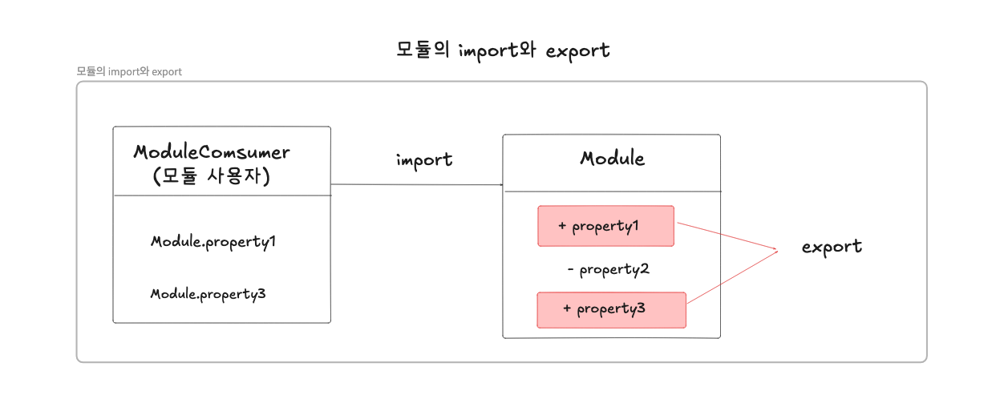

## 모듈

---

### 1. 모듈의 일반적 의미

모듈 = 어플리케이션을 구성하는 개별적인 요소로 재사용 가능한 코드 조각을 의미함
- 일반적으로 모듈은 기능을 기준으로 파일 단위로 분리함
- 모듈은 자신만의 파일 스코프(모듈 스코프)를 가질 수 있어야 함

자신만의 파일 스코프를 갖는 모듈의 자산(모듈에 포함되어 있는 변수, 함수, 객체 등)은 기본적으로 비공개 상태임
- 자신만의 파일 스코프를 갖는 모듈의 모든 자산은 캡슐화되어 다른 모듈에서 접근할 수 없음
- 모듈은 개별적인 존재로서 어플리케이션과 분리되어 존재
- 하지만 어플리케이션과 완전히 분리되어 개별적으로 존재하는 모듈은 재사용이 불가능함으로 존재의 의미가 없음

-> 모듈은 어플리케이션이나 다른 모듈에 의해 재사용되어야 의미가 있음

모듈은 공개가 필요한 자산에 한정하여 명시적으로 선택적 공개가 가능함 = export 키워드

공개된 모듈의 자산 = 다른 모듈에서 재사용할 수 있음
- 공개된 모듈의 자산을 사용하는 모듈 = 모듈 사용자라고 함

모듈 사용자
- 모듈이 공개한 자산 중 일부 또는 전체를 선택하여 자신의 스코프 내로 불러들여 재사용할 수 있음 = import 키워드

예시



모듈 사용 시 코드의 단위를 명확히 분리하여 어플리케이션을 구성할 수 있고, 재사용성이 좋아서 개발 효율성과 유지 보수성을 높일 수 있음

<br/>

### 2. JS와 모듈

JS
- 웹 페이지의 보조 기능을 처리하기 위한 제한적인 용도를 목적으로 탄생함
- 모듈 시스템을 지원하지 않음
- JS는 모듈이 성립하기 위해 필요한 파일 스코프와 import,export를 지원하지 않았음

C언어 - ```#includ```, Java - ```import``` 등 대부분의 프로그래밍 언어는 모듈 기능을 가지고 있음

반면 JS는 script 태그를 사용하여 외부의 JS 파일을 로드할 수 있지만 파일마다 독립적인 파일 스코프를 갖지 않음

JS 파일을 여러 개의 파일로 분리하여 script 태그로 로드해도 분리된 JS 파일들은 결국 하나의 JS 파일 내에 있는 것처럼 동작함
- 모든 JS 파일은 하나의 전역을 공유함
- 분리된 JS 파일들은 전역 변수가 중복되는 등의 문제가 발생할 수 있음

CommonJS와 AMD(Asynchronous Module Definition)이 등장함
- JS의 모듈 시스템은 CommonJS와 AMD 진영으로 나누어지게 되었으며 브라우저 환경에서 모듈을 사용하기 위해 CommonJS 또는 AMD를 구현한 로더 라이브러리를 사용해야 하는 상황이 발생됨 

JS 런타임 환경인 Node.js의 모듈 시스템
- CommonJS를 채택하고, 이후에 독자적인 발전이 있음
- Node.js는 ESMAScript 표준사양은 아니지만 모듈 시스템을 지원함

-> 따라서 Node.js 환경에서는 파일별로 독립적인 파일 스코프(모듈 스코프)를 가짐

<br/>

### 3. ES6 모듈(ESM)

ES6에서 클라이언트 사이드 자바스크립트(웹 사이트에서 실행되는 자바스크립트)에서도 동작할 수 있는 모듈 기능을 추가함
- IE를 제외한 대부분의 브라우저에서는 ES6 모듈을 사용할 수 있음

ES6 모듈(ESM)의 사용법
- script 태그에 type="module" 어트리뷰트를 추가하면 로드된 자바스크립트 파일은 모듈로서 동작함
- 일반적인 자바스크립트 파일이 아닌 ESM임을 명확히 하기 위해 ESM의 파일 확장자는 mjs로 사용함
- ESM에는 클래스와 마찬가지로 기본적인 strict mode가 적용됨

```HTML
<script type ="module" src = "app.mjs"></script>
```


#### 모듈 스코프

ESM은 독자적인 모듈 스코프를 가짐
- ESM이 아닌 일반적인 JS 파일은 script 태그로 분리해서 로드해도 독자적인 모듈 스코프를 가지지 않음

foo.js
```javascript
//x변수는 전역 변수임
var x = 'foo';
console.log(window.x); //foo
```

bar.js
```JavaScript
//x 변수는 전역변수임
//foo.js에서 선언한 전역 변수 x와 중복된 선언임
var x = 'bar';

//foo.js에서 선언한 전역변수 x의 값이 재할당됨
console.log(window.x); //bar
```

HTML파일
- script 태그를 분리하여 로드된 2개의 JS 파일은 하나의 JS 파일 내에 있는 것처럼 동작함(하나의 전역을 공유함)
- foo.js에서 선언한 x 변수와 bar.js에서 선언한 x 변수는 중복 선언되며 의도치 않게 x 변수의 값이 덮어써짐
```HTML
<!DOCTYPE html>
<html>
<body>
    <script src="foo.js"></script>
    <script src="bar.js"></script>
</body>
</html>
```

ESM
- 파일 자체의 독자적인 모듈 스코프를 제공함
- 따라서 모듈 내에서 var 키워드로 선언한 변수는 더는 전역 변수가 아니며 winodw 객체의 프로퍼티도 아님

foo.mjs
```JavaScript
//x변수는 전역 변수가 아니며, window 객체의 프로퍼티도 아님
var x = 'foo';
console.log(x); //foo
console.log(window.x); //undefined
```

bar.mjs
```JavaScript
//x변수는 전역 변수가 아니며, window 객체의 프로퍼티도 아님
var x = 'bar';
console.log(x); //bar
console.log(window.x); //undefined
```


HTML 파일
```HTML
<!DOCTYPE html>
<html>
<body>
    <script type="module" src="foo.mjs"></script>
    <script type="module" src="bar.mjs"></script>
</body>
</html>
```

모듈 내에서 선언한 식별자는 모듈 외부에서 참조할 수 없음
- 모듈 스코프가 다르기 때문

#### export 키워드

모듈은 독자적인 모듈 스코프를 가짐
- 모듈 내부에서 선언한 모든 식별자는 기본적으로 해당 모듈 내부에서만 참조할 수 있음
- 모듈 내부에서 선언한 식별자를 외부에 공개하여 다른 모듈들이 재사용할 수 있게 하려면 export 키워드를 사용해야 함
- export 키워드는 선언문 앞에 사용하며, 변수, 함수, 클래스 등 모든 식별자를 export할 수 잇음

lib.mjs
```JavaScript
//변수 공개
export const pi = Math.PI;

//함수 공개
export function square(x){
    return x * x;
}

//클래스 공개
export class Person{
    constructor(name){
        this.name = name;
    }
}
```

선언문 앞에 매번 export 키워드를 붙이는 것이 번거롭다면 export할 대상을 하나의 객체로 구성하여 한번에 export할 수도 있음

lib.mjs
```JavaScript
const pi = Math.PI;

function square(x){
    return x * x;
}

class Person {
    constructor(name){
        this.name = name;
    }
}

//변수, 함수, 클래스를 하나의 객체로 구성하여 공개
export { pi, square, Person };
```
<br/>

#### import 키워드

다른 모듈에서 공개한 식별자를 자신의 모듈 스코프 내부로 로드하려면 import 키워드를 사용함
- 다른 모듈이 export한 식별자 이름으로 import해야 하며, ESM의 경우 파일 확장자를 생략할 수 없음

app.mjs
```JavaScript
//같은 폴더 내의 lib.mjs 모듈이 export한 식별자 이름으로 import해야 함
//ESM의 경우 파일 확장자를 생략할 수 없음
import { pi, square, Person } from './lib.mjs';

console.log(pi); //3.14.....
console.log(square(10)); //100
console.log(new Person('Lee')); //Person { name: 'Lee' }
```

HTML 파일
- app.mjs는 어플리케이션의 진입접임으로 반드시 script 태그로 로드해야 함
- lib.mjs는 app.mjs의 import 문에 의해 로드되는 의존성임(따라서 lib.mjs는 script 태그로 로드하지 않아도 됨)
```HTML
<!DOCTYPE html>
<html>
<body>
    <script type="module" src="app.mjs"></script>
</body>
</html>
```

모듈이 export한 식별자 이름을 일일이 지정하지 않고 하나의 이름으로 한 번에 import할 수 있음
- 이때 import 되는 식별자는 as 뒤에 지정한 이름의 객체에 프로퍼티로 할당됨

app.mjs
```JavaScript
//lib.mjs 모듈이 export한 모든 식별자를 lib 객체의 프로퍼티로 모아 import함
import * as lib from './lib.mjs';

console.log(lib.pi); //3.14....
console.log(lib.square(10)); //100
console.log(new lib.Person('Lee')); //Person { name: 'Lee' }
```

모듈이 export한 식별자 이름을 변경하여 import할 수 있음

app.mjs
```JavaScript
//lib.mjs 모듈이 export한 식별자 이름을 변경하여 import함
import { pi as PI, square as sq, Person as P } from './lib.mjs';

console.log(PI); //3.14....
console.log(sq(2)); //4
console.log(new P('Kim')); //Person {name: 'Kim'}
```

모듈에서 하나의 값만 export한다면 default 키워드를 사용할 수 잇음
- default 키워드를 사용하는 경우 기본적으로 이름 없이 하나의 값은 export함

lib.mjs
```JavaScript
export default x => x * x;
```

default 키워드를 사용하는 경우 var, let, const 키워드를 사용할 수 없음

lib.mjs
```JavaScript
export default const foo = () => {}; //SyntaxError
```

default 키워드와 함께 export한 모듈은 {}없이 임의의 이름으로 import함

app.mjs
```JavaScript
import square from './lib.mjs';

console.log(square(3)); //9
```
