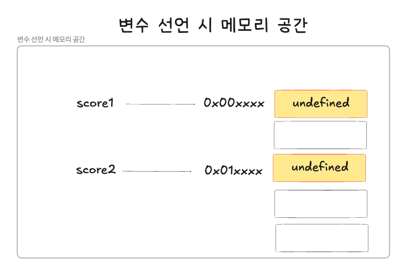
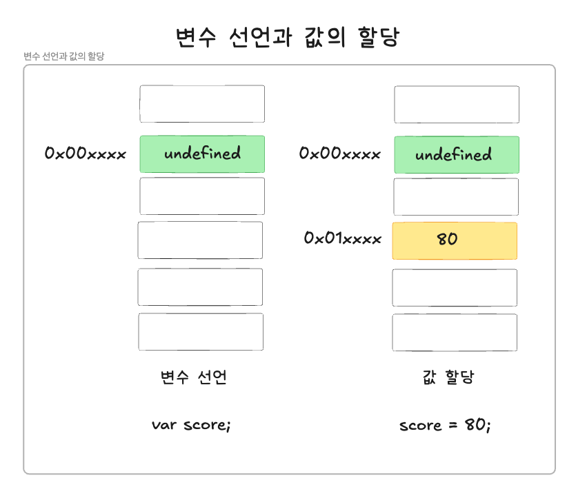

# 4장 변수

---

## 1. 변수란 무엇인가? 왜 필요한가?

변수의 정의
1. 값을 저장하기 위해 확보한 메모리 공간
2. 값이 할당된 메모리 공간을 식별하기 위한 이름(식별자)
<br/>

예시 - 변수 사용 <br/>
- 변수명 = result
- 변수에 저장된 값 = 30
- 할당 = 변수에 값을 저장하는 것
- 참조 = 변수에 저장된 값을 읽어 들이는 것

```JavaScript
const result = 10 + 20;
console.log(result);
```
<br/>

## 2. 식별자

변수명 = 식별자 = 값이 할당된 메모리 공간을 식별하기 위한 이름
- 식별자는 값이 아닌 메모리 주소를 기억하고 있음

예시 - 변수 사용 코드
- 변수명 result는 10 + 20의 결과 값인 30의 결과 값인 메모리 주소값을 기억하고 있음

```JavaScript
const result = 10 + 20;
console.log(result);
```
<br/>


식별자는 단지 변수뿐만 아닌 함수, 클래스 등 모두 식별자가 됨
- 메모리상에 존재하는 어떤 값을 식별할 수 있는 이름을 모두 식별자라고 함

변수,함수, 클래스 등과 같은 식별자는 네이밍 규칙을 준수해야 하며, 선언에 의해 JS엔진에 식별자의 존재를 알림
<br/>

## 3. 변수 선언

변수 선언 = 변수를 생성하는 것을 의미
1. 메모리 공간을 확보
2. 변수명과 확보한 메모리 공간의 주소를 연결하여 값을 저장할 수 있도록 준비

**변수를 사용하려면 반드시 선언이 필요함**

변수를 선언할 때는 var, let, const 키워드를 사용함
- ES6부터 let, const 키워드 추가됨

```JavaScript
var score1;
console.log(score1);
```

```JavaScript
let score2;
console.log(score2);
```



변수 선언 후, 아무런 값을 확보하지 않으면 해당 메모리 공간에 JS엔진에 의해 undefined라는 값이 암묵적으로 할당되어 초기화됨

JS 엔진의 변수 선언 수행 과정 
- 선언 단계 = 변수 이름을 등록하여 JS엔진에 변수의 존재를 알ㄹ임
- 초기화 단계 = 값을 저장하기 위한 메모리 공간을 확보하고 암묵적으로 undefined를 할당하여 초기화함
<br/>

변수 이름의 등록
- 변수이름을 비롯한 모든 식별자는 실행 컨텍스트에 등록됨
- 실행 컨텍스트 = JS엔진이 소스코드를 평가하고 실행하기 위한 환경을 제공하고, 코드 실행 결과를 관리함
  - 변수명과 변수 값은 실행 컨텍스트 내 키 - 값 형식의 객체로 등록되어 관리함

변수 및 모든 식별자(함수, 클래스 등)은 선언이 필요하며, 선언하지 않은 식별자에 접근하면 ReferenceError(참조 에러)가 발생함

ReferenceError 
- 식별자를 통해 값을 참조하려고 했지만, JS엔진이 등록된 식별자를 찾을 수 없을 때 발생함
<br/>

## 4. 변수 선언의 실행 시점과 변수 호이스팅

JS엔진은 소스 코드를 실행(런타임)하기전 소스 코드의 평가 과정을 거침
- 변수 선언을 포함한 모든 선언문(변수 선언문, 함수 선언문 등)을 소스 코드에서 찾음
- 소스 코드 평가 과정이 끝나면 변수 선언을 포함한 모든 선언문을 제외하고 소스코드를 한 줄씩 실행함

-> JS엔진은 변수 선언이 소스 코드에서 어느 위치에 있든 상관없이 참조할 수 있음

-> 이를 호이스팅이라고 하며, 변수 선언뿐만 아닌 모든 식별자(변수, 함수, 클래스 등)은 호이스팅이 됨

```JavaScript
console.log(score); //undefined

var score; //변수 선언
```
<br/>

## 5. 값의 할당

할당 연산자를 사용하여 변수에 값을 할당함

변수에 값을 할당
```JavaScript
var score; //변수 선언
score = 80; //값 할당
```

변수 선언과 값 할당(변수 초기화)
```JavaScript
var score = 80;
```

⚠️ 주의해야 할 점
- 변수 선언 = 런타입 이전에 실행
- 값 할당 = 소스코드가 순차적으로 실행되는 런타임 시점에 실행

```JavaScript
console.log(score); //undefined

var score; //변수 선언
score = 80; //값 할당

console.log(score); //80
```



<br/>

## 6. 값의 재할당

재할당 = 이미 값이 할당되어 있는 변수에 새로운 값을 다시 할당하는 것을 의미함

```JavaScript
let score = 80; //변수 선언과 값의 할당
score = 90; //값의 재할당
```
<br/>

변수 = 저장된 값을 다른 값으로 변경이 가능함

상수 = 변수에 저장된 값을 재할당할 수 없음

```JavaScript
const foo = 10;
foo = 200; //에러 발생
```
<br/>

값의 재할당 예시
1. 변수 score 선언 후 80의 값을 할당함
2. score 변수에 다시 90의 값을 재할당함
- undefined와 80의 값은 식별자와 연결되어 있지 않아, JS의 GC에 의해 메모리에서 자동으로 해제됨
```JavaScript
let score; //undefined
score = 80; //80
score = 90; //90
console.log(score); //90
```


가비지 컬렉션
- 어플리케이션이 할당한 메모리 공간을 주기적으로 검사하여 더 이상 사용되지 않는 메모리를 해제하는 기능을 가짐
- JS는 GC를 내장하고 있는 언어로 GC를 통해 메모리 누수를 방지함

<br/>

## 7. 식별자 네이밍 규칙
식별자 = 값을 구별해 낼수 있는 고유한 이름을 의미함

식별자의 네이밍 규칙
- 식별자는 특수문자를 제외한 문자, 숫자, 언더스코어(_), 달러 기호($)를 포함할 수 있음
- 단, 식별자는 숫자로 시작하는 것은 허용하지 않음
- 예약어는 식별자로 사용이 할 수 없음

네이밍 규칙을 위배한 식별자의 예시
```JavaScript
let first-name;
let 1st;
let this;
```
<br/>

네이밍 컨벤션은 총 4개가 존재하며, JS에서 일반적으로 변수나 함수의 이름에는 카멜 케이스를 사용하고, 생성자 함수나 클래스 이름에는 파스칼 케이스를 사용함

```JavaScript
//카멜 케이스
let firstName;

//스네이크 케이스
let first_name;

//파스칼 케이스
let Firstname;

//헝가리언 케이스
let strFristName;
let $elem = document.getElementById('myId);
let observable$ = fromEvent(document, 'click');
```
<br/>
