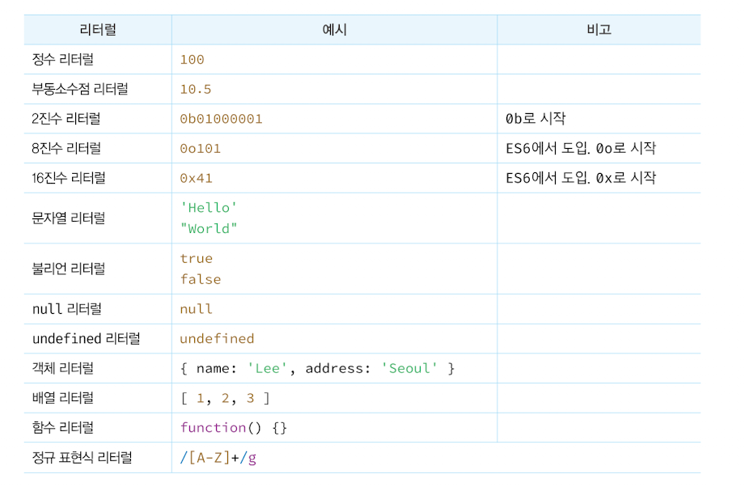

# 5장. 표현식과 문

---

## 1. 값

값 = 표현식이 평가되어 생성된 결과를 의미

예시
- 10 + 20인 숫자 값 30이 생성됨
- 변수 sum에 할당 되는 값은 10,20이 아닌 10 + 20 이 수행된 30인 값 
```JavaScript
10 + 20; //30
let sum = 10 + 20; 
```

모든 값은 데이터 타입을 가지며, 메모리에 2진수로 저장됨
<br/>

## 2. 리터럴

리터럴 = 사람이 이해할 수 있는 문자 또는 약속된 기호를 이용하여 값을 생성하는 표기법
- 아라비아 숫자, 알파벳, 한글 등
- JS엔진은 코드 실행 시점인 런타임에 리터럴을 평가하여 값을 생성함

숫자 리터럴 3
```JavaScript
3
```


<br/>

## 3. 표현식

표현식 = 값으로 평가될 수 있는 문
- 표현식이 평가되면 새로운 값을 생성하거나 기존의 값을 참조함
- 리터럴도 표현식으로 인식됨

리터럴은 값 자체이면서 표현식

```JavaScript
let score = 100;
```

변수 식별자를 사용하여 출력
- 변수 식별자를 참조하면 변수 값으로 평가됨
- 식별자 참조 = 값을 생성하지 않지만, 값으로 평가됨으로 표현식
```JavaScript
let score = 50  + 50; 
console.log(score); //100
```
<br/>

표현식은 리터럴, 식별자(변수, 함수 등의 이름), 연산자, 함수 호출 등에서 모두 평가가 된다는 점에서 모두 동일함
- 값으로 평가될 수 있는 문은 모두 표현식임

```JavaScript
//리터럴 표현식
10
'Hello'

//식별자 표현식
sum
person.name
arr[1]

//연산자 표현식
10 + 20
sum = 10
sum !== 10

//함수, 메소드 호출 표현식
square()
persobn.getName()
```
<br/>

## 4. 문

문 = 프로그램을 구성하는 기본단위이자 최소 실행단위
- 문은 여러 토큰으로 구성됨
- 토큰 = 문법적인 의미를 가지며, 문법적으로 더 이상 나눌 수 없는 코드의 기본 요소를 의미함

토큰의 예시

<br/>

문은 명령문이라고 하며 선언문, 할당문, 조건문, 반복문 등으로 구분할 수 있음
```JavaScript
//변수 선언문
let x;

//할당문
x = 5;

//함수 선언문
function foo () {}

//조건문
if(x > 1) {
    console.log(x);
}

//반복문
for(var i = 0; i< 2; i++){
    console.log(i);
}
```
<br/>

## 5. 세미콜론과 세미콜론 자동 삽입 기능

세미콜론(;)은 문의 종료를 나타내며, JS엔진은 세미콜론으로 문이 종료된 위치를 파악하고 순차적으로 문을 실행함
- if문, for문, 함수 등의 코드 블록 뒤에는 세미콜론을 붙이지 않음

-> 해당 코드 블록은 언제나 문의 종료를 의미하는 자체 종결성을 가짐

세미콜론은 생략이 가능하며, JS엔진이 소스 코드를 해석할 때 문의 끝이라고 예측되는 지점에 세미콜론을 자동으로 붙여주는 세미콜론 자동 삽입 기능이 암묵적으로 실행됨
- 하지만, 세미콜론 자동 삽입 기능의 동작과 개발자의 예측이 일치하지 않은 경우가 존재하여 세미콜론을 붙이는 것을 권장함

```JavaScript
// ASI의 동작 결과 => var bar = function() {} (function() {}) ();
// 개발자의 예측 => var bar = function() {}; (function() {}) ();
// 타입 에러 발생(TypeError)

var bar = fucntion () {}
(function() {}) ();
```
<br/>

## 6. 표현식인 문과 표현식이 아닌 문

표현식인 문과 표현식이 아닌 문을 구별하는 간단한 방법 = 변수에 할당하는 것
- 표현식인 문은 값으로 평가됨으로 변수에 할당할 수 있음
- 표현식이 아닌 문은 평가할 수 없으므로 변수에 할당시 에러가 발생됨

표현식이 아닌 문
```JavaScript
//표현식이 아닌 문은 값처럼 사용될 수 없음
var foo = var x; //타입 에러
```

표현식인 문
```JavaScript
//표현식인 문은 값처럼 사용할 수 있음
let foo = 100;
console.log(foo); //100
```
<br/>
